# 🧩 LeetCode #1 — Two Sum

> **[Open on LeetCode →](https://leetcode.com/problems/two-sum/)**
> **Difficulty:** Easy | **Topic:** Array, Hash Map

---

## 📋 Problem Statement

Given an integer array `nums` and an integer `target`, return the **indices** of the two numbers such that they add up to `target`.

**Constraints:**
- Each input has exactly **one** valid answer.
- You **cannot** use the same element twice.
- Return the answer in **any order**.

---

## 📌 Examples

```
Input:  nums = [2, 7, 11, 15],  target = 9
Output: [0, 1]
Reason: nums[0] + nums[1] = 2 + 7 = 9 ✅

Input:  nums = [3, 2, 4],  target = 6
Output: [1, 2]
Reason: nums[1] + nums[2] = 2 + 4 = 6 ✅

Input:  nums = [3, 3],  target = 6
Output: [0, 1]
Reason: nums[0] + nums[1] = 3 + 3 = 6 ✅
```

---

## 🗺️ Understanding the Problem First

Before writing any code, map out what is actually being asked:

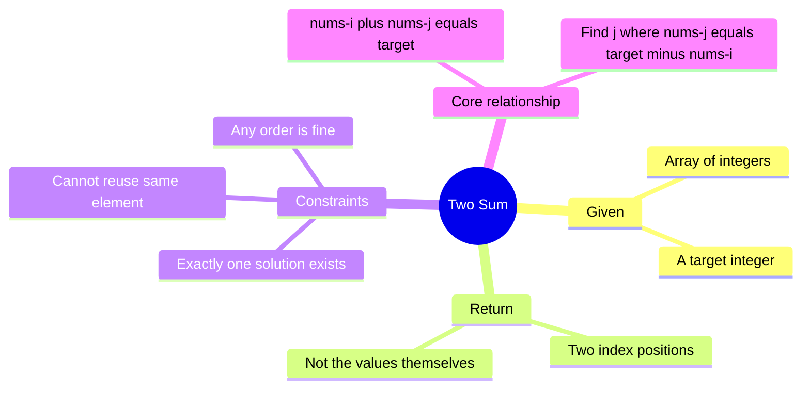

---

## 🧭 The Two Phases of Solving

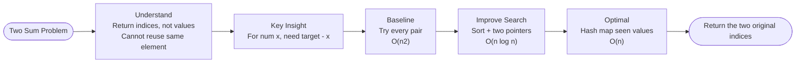

We always start in **Phase 1** — reading slowly, restating the problem, identifying what the output looks like. Only then do we enter **Phase 2** — writing code, improving it, and proving why each step up is better.

---

## 🔑 Core Insight Before Any Code

The key formula that unlocks everything:

```
complement = target - current_number
```

Instead of asking *"which two numbers add up to target?"*,
we ask *"given this number, what is the one other number I need?"*

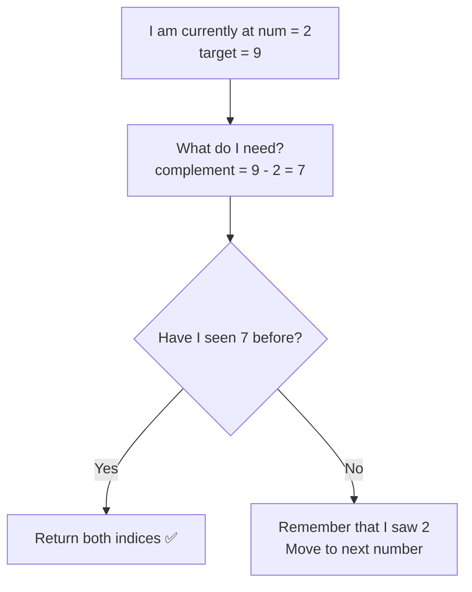

---

## 📊 Solution Progression Overview

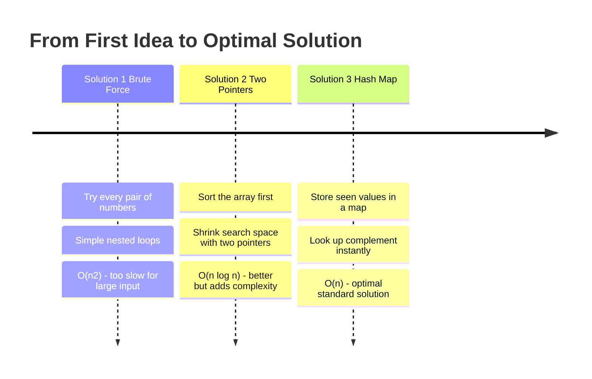

---

---

# ✏️ Solution 1 — Brute Force

## Thinking From This Perspective

**My starting thought:** *"I need two numbers that add up to target. The simplest thing I can do is try every possible pair and check."*

This is the most natural first instinct. Fix one number, loop over every other number after it, check if they sum to target.

---

## Visual — What Brute Force Does

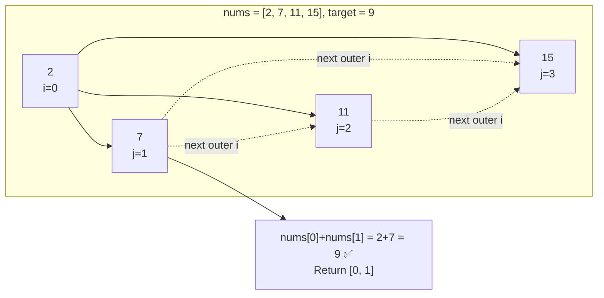

---

## Complexity

```
Time:  O(n²)  — for every element, we scan all remaining elements
Space: O(1)   — no extra memory used
```

---

## ✅ Full LeetCode Solution — Brute Force

```python
from typing import List


class Solution:
    def twoSum(self, nums: List[int], target: int) -> List[int]:
        n = len(nums)

        for i in range(n):                   # fix the first number
            for j in range(i + 1, n):        # try every number after it
                if nums[i] + nums[j] == target:
                    return [i, j]            # found the pair

        return []                            # guaranteed answer exists, but safe fallback
```

---

## Why I Move to the Next Solution

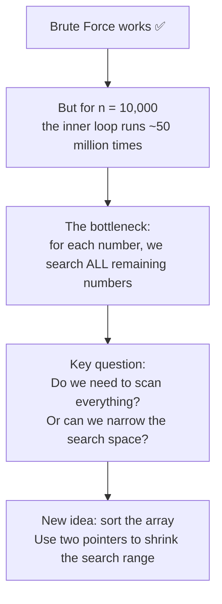

---
---

# ✏️ Solution 2 — Two Pointers (Sort First)

## Thinking From This Perspective

**My new thought:** *"If the array were sorted, I could use two pointers — one at the smallest value, one at the largest. If their sum is too small, move left pointer right. If too large, move right pointer left. I never need a full inner scan."*

The catch: sorting changes index positions, so I must save original indices before sorting.

---

## Visual — How Two Pointers Work

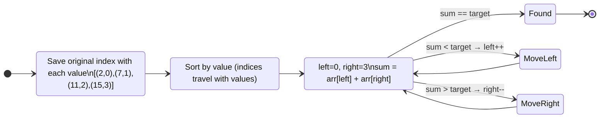

---

## Pointer Movement on Example

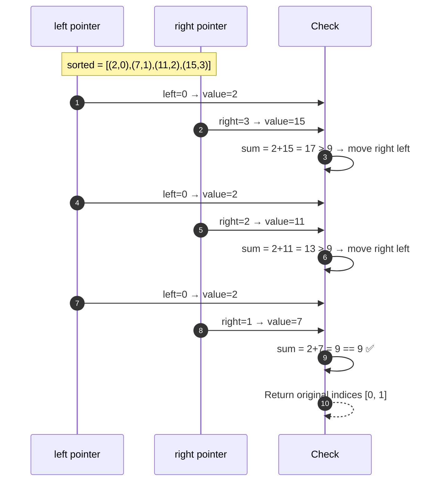

---

## Complexity

```
Time:  O(n log n)  — dominated by the sort step
Space: O(n)        — we store (value, original_index) pairs
```

---

## ✅ Full LeetCode Solution — Two Pointers

```python
from typing import List


class Solution:
    def twoSum(self, nums: List[int], target: int) -> List[int]:
        # Pair each value with its original index before sorting
        indexed = [(num, i) for i, num in enumerate(nums)]
        indexed.sort(key=lambda x: x[0])        # sort by value

        left = 0
        right = len(indexed) - 1

        while left < right:
            current_sum = indexed[left][0] + indexed[right][0]

            if current_sum == target:
                return [indexed[left][1], indexed[right][1]]   # return original indices

            elif current_sum < target:
                left += 1     # need a bigger sum → move left up

            else:
                right -= 1    # need a smaller sum → move right down

        return []
```

---

## Why I Move to the Next Solution

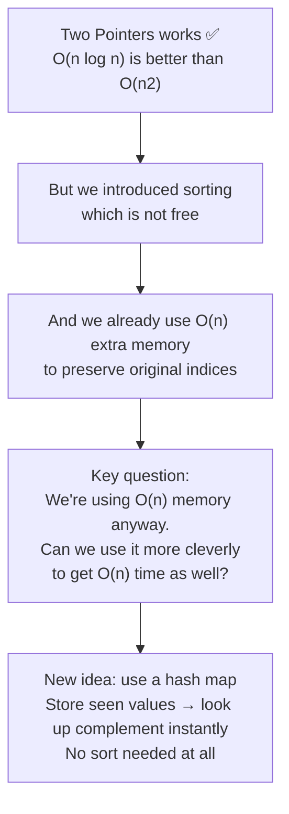

---
---

# ✏️ Solution 3 — Hash Map (Optimal)

## Thinking From This Perspective

**My final thought:** *"Instead of sorting and then searching, I can scan once. For each number, I compute its complement. If that complement was already seen, I'm done. If not, I remember this number. One pass, O(n)."*

---

## Visual — One-Pass Hash Map

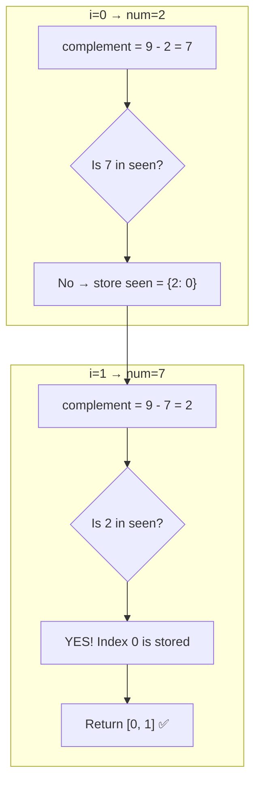

---

## Full Walkthrough

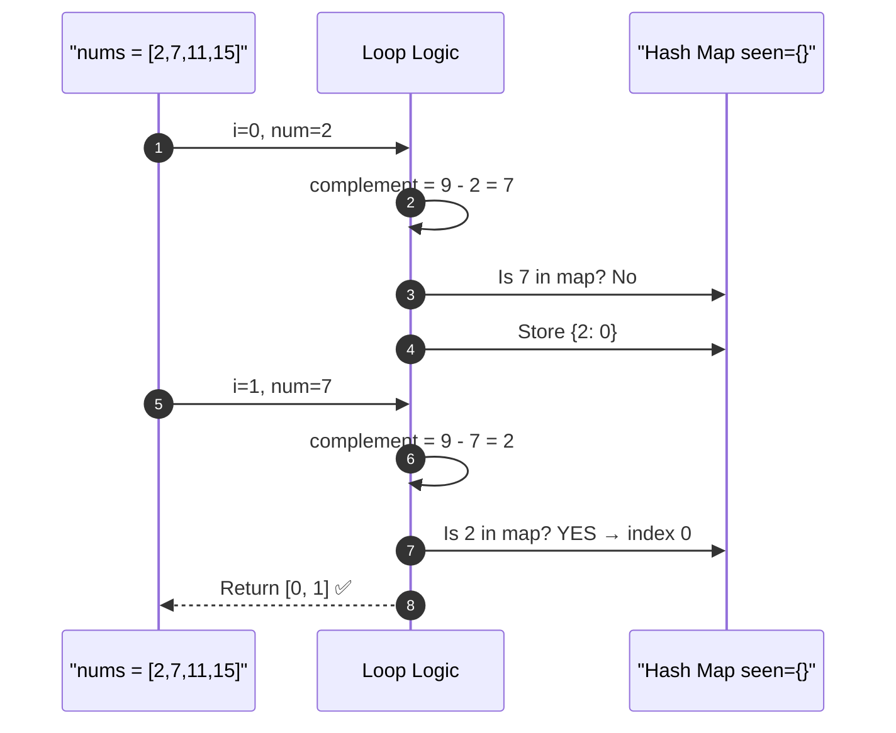

---

## Complexity

```
Time:  O(n)   — single pass through the array
Space: O(n)   — hash map stores at most n entries
```

---

## ✅ Full LeetCode Solution — Hash Map

```python
from typing import List


class Solution:
    def twoSum(self, nums: List[int], target: int) -> List[int]:
        seen = {}                          # maps: number → its index

        for i, num in enumerate(nums):
            complement = target - num      # what value do I need?

            if complement in seen:         # did I already see it?
                return [seen[complement], i]

            seen[num] = i                  # remember this number for future lookups

        return []
```

---

## Why This Is the Final Answer

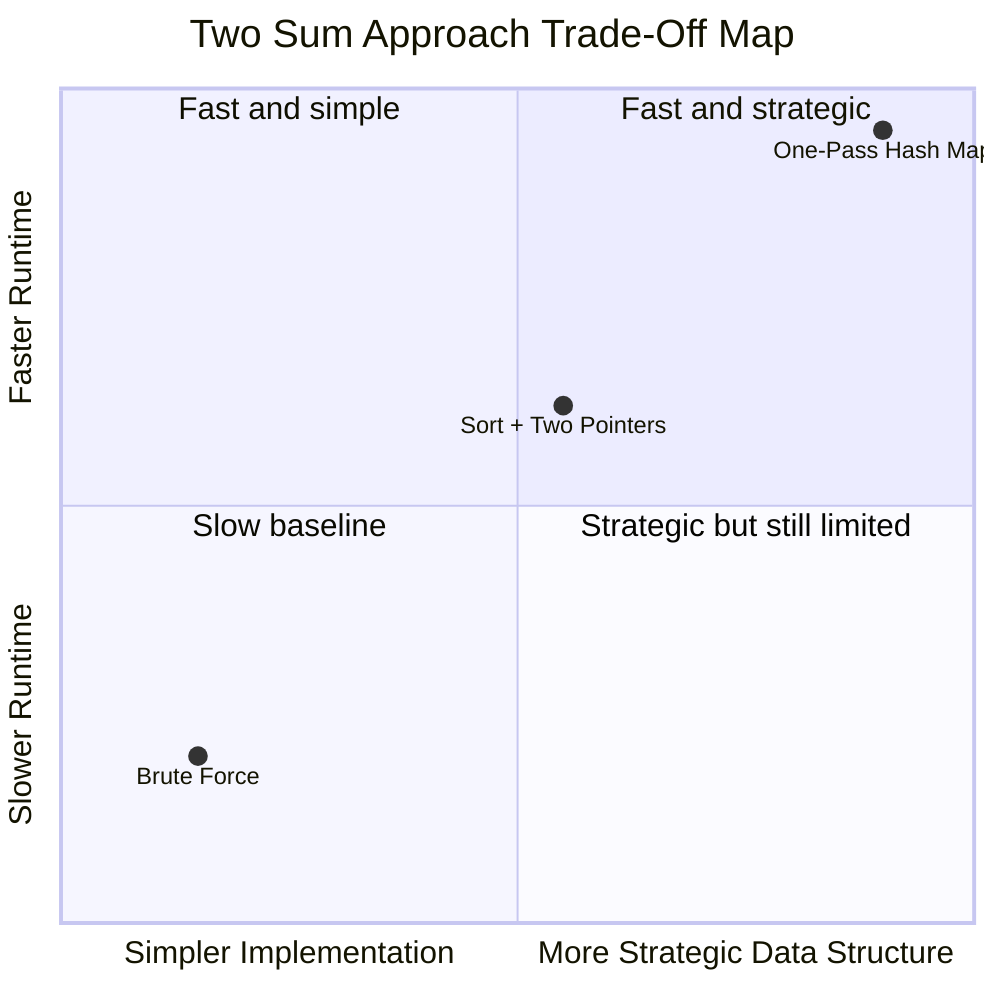

---

## 🔁 The Reusable Pattern

```python
# Hash Map Lookup Pattern
seen = {}
for i, item in enumerate(collection):
    needed = compute_what_is_needed(item)
    if needed in seen:
        return answer_using(seen[needed], i)
    seen[item] = i
```

Apply this pattern to: **two sum variants, pair detection, complement problems, previously-seen lookups.**

---

## ✅ Final Takeaways

```
1. Core formula:  complement = target - num
2. Hash map answers "Have I seen this?" in O(1)
3. Check BEFORE inserting → prevents reusing same element
4. Progression: O(n²) → O(n log n) → O(n)
5. Each step up removes one source of wasted work
```

> 💡 If a problem needs you to find what is **missing** to complete a pair, compute it directly and look it up.
