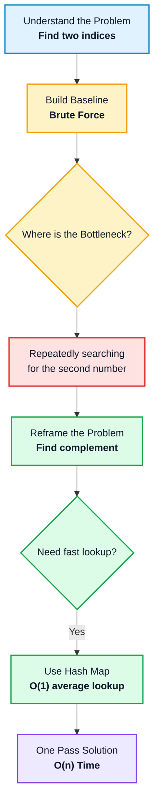
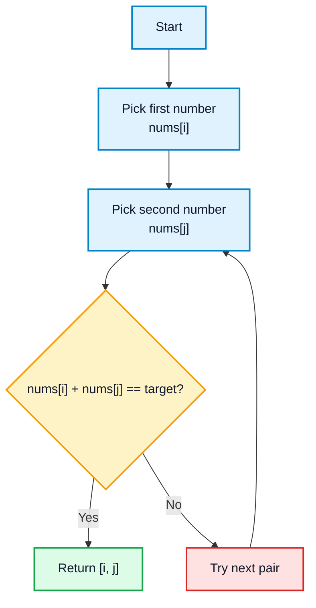
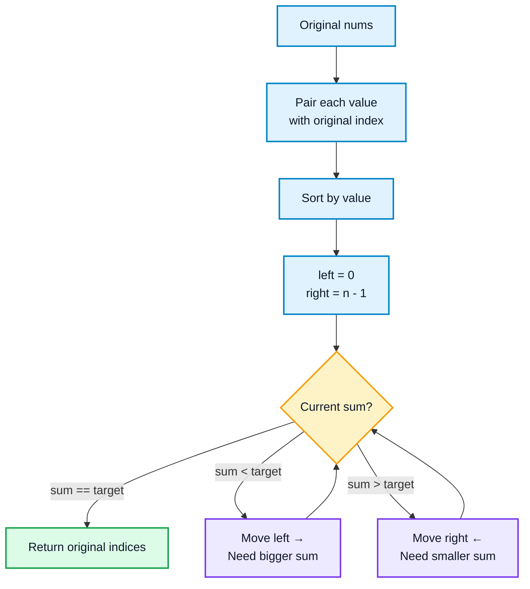
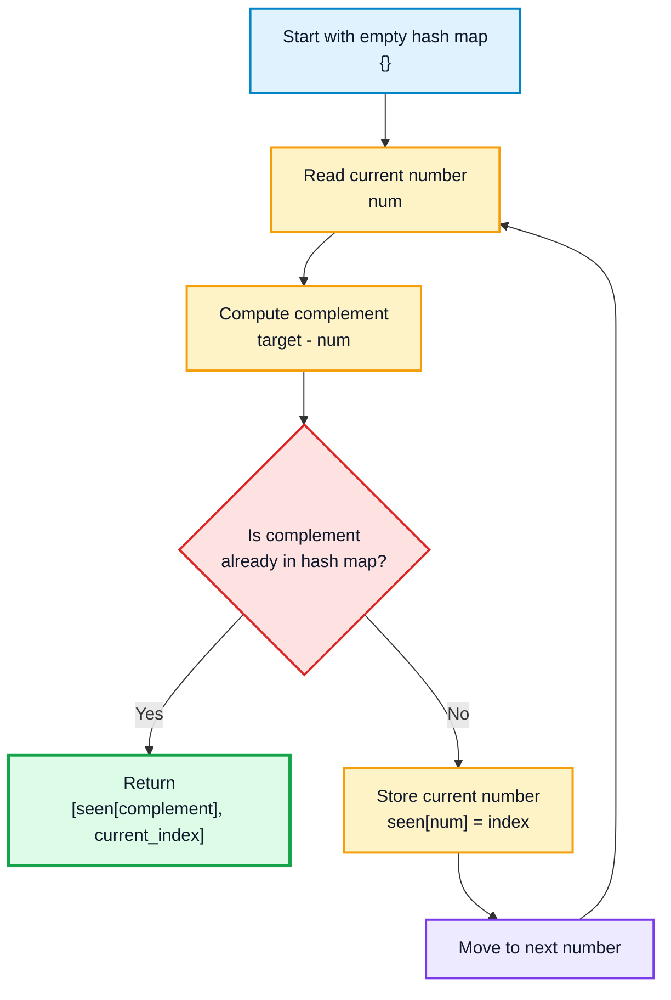
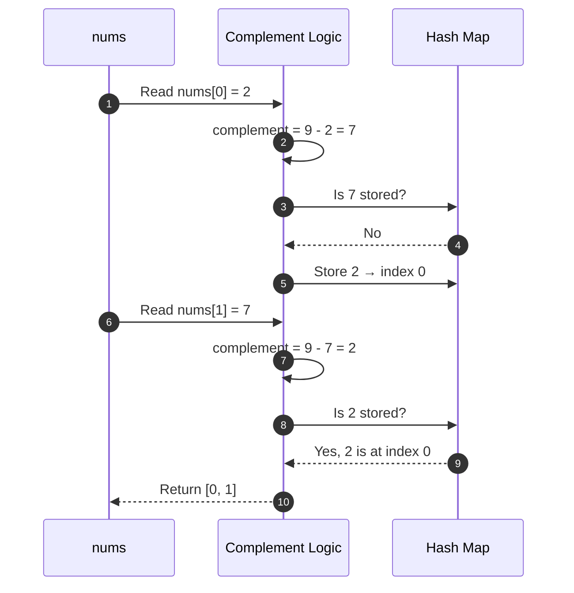
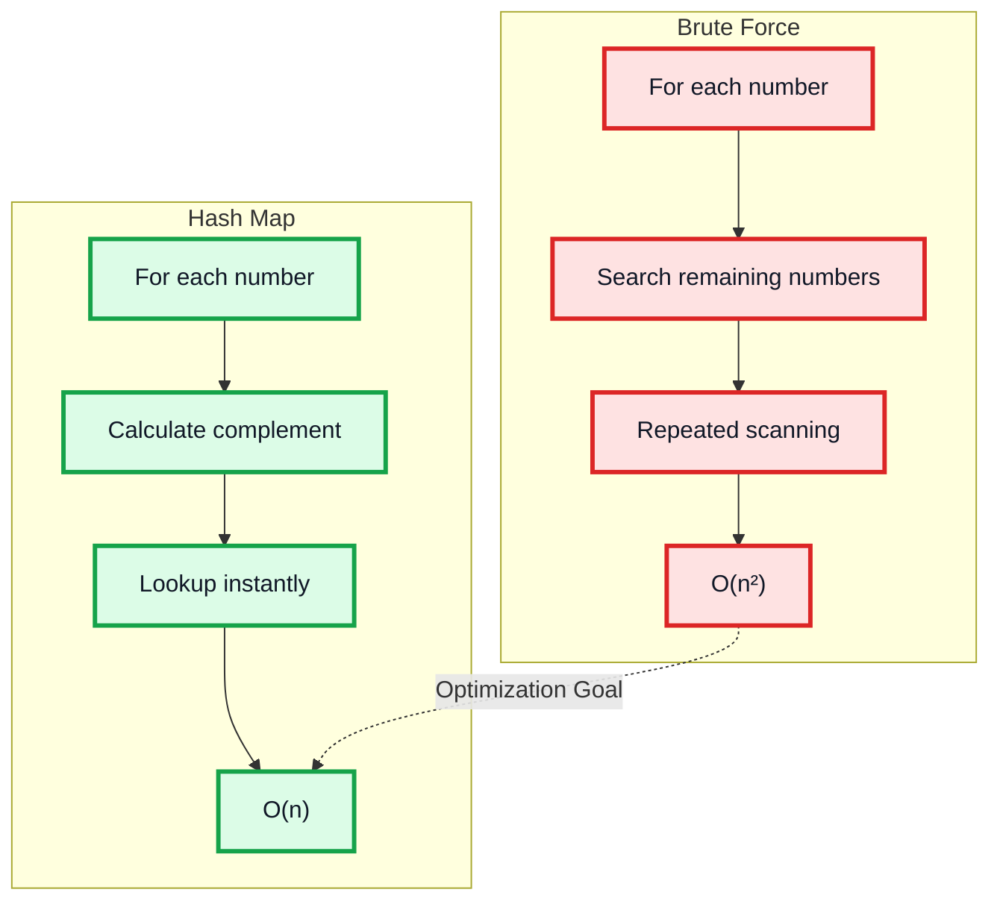
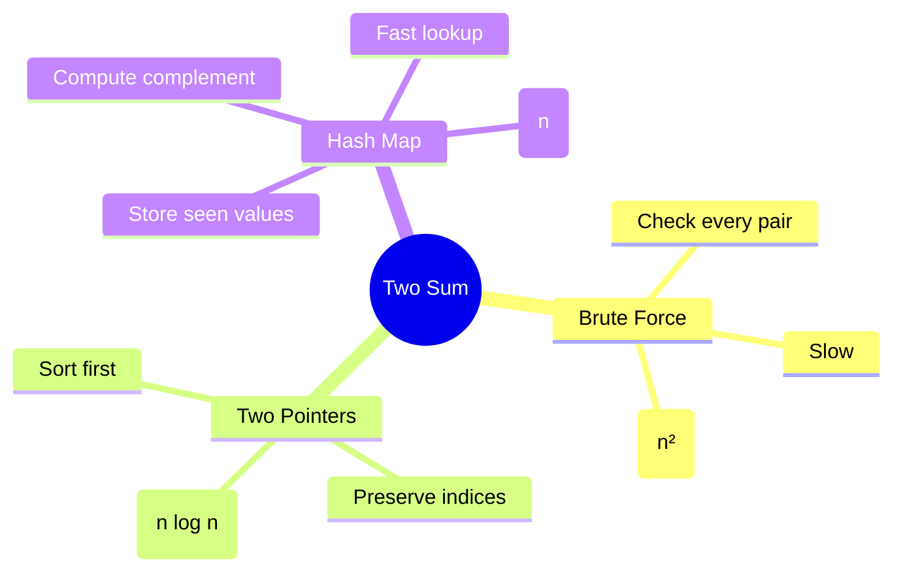

# LeetCode #1: Two Sum — Strategic Study Guide

## Problem

Given an integer array `nums` and an integer `target`, return the indices of the two numbers such that they add up to `target`.

### Constraints

- Each input has exactly one solution.
- You cannot use the same element twice.
- The answer can be returned in any order.

---

## Example

```text
Input:
nums = [2, 7, 11, 15]
target = 9

Output:
[0, 1]

Explanation:
nums[0] + nums[1] = 2 + 7 = 9
```

---

# Core Insight

The problem asks for:

```text
x + y = target
```

Instead of searching for both numbers blindly, fix one number and calculate what the other number must be:

```text
complement = target - current_number
```

So the real question becomes:

```text
Have I seen this complement before?
```

---

# Strategic Problem-Solving Flow



---

# Approach Overview

```mermaid
flowchart LR
    subgraph A["Approach 1"]
        A1["Brute Force"]
        A2["Check every pair"]
        A3["Time: O(n²)"]
    end

    subgraph B["Approach 2"]
        B1["Two Pointers"]
        B2["Sort first"]
        B3["Time: O(n log n)"]
    end

    subgraph C["Approach 3"]
        C1["Hash Map"]
        C2["Complement lookup"]
        C3["Time: O(n)"]
    end

    A --> B --> C

    classDef slow fill:#fee2e2,stroke:#dc2626,stroke-width:2px,color:#111827;
    classDef medium fill:#fef3c7,stroke:#f59e0b,stroke-width:2px,color:#111827;
    classDef fast fill:#dcfce7,stroke:#16a34a,stroke-width:2px,color:#111827;

    class A,A1,A2,A3 slow;
    class B,B1,B2,B3 medium;
    class C,C1,C2,C3 fast;
```



---

# Comparison Table

| Approach | Core Idea | Time | Space | Verdict |
|---|---|---:|---:|---|
| Brute Force | Check every pair | `O(n²)` | `O(1)` | Too slow |
| Two Pointers | Sort and shrink search space | `O(n log n)` | `O(n)` | Better, but not optimal |
| Hash Map | Store seen values and lookup complement | `O(n)` | `O(n)` | Best standard solution |

---

# 1. Brute Force Approach

## Idea

Try every possible pair and check whether their sum equals the target.

This is simple, but inefficient.

---

## Brute Force Logic



---

## Code

```python
from typing import List


class Solution:
    def twoSum_brute_force(self, nums: List[int], target: int) -> List[int]:
        n = len(nums)

        for i in range(n):
            for j in range(i + 1, n):
                if nums[i] + nums[j] == target:
                    return [i, j]

        return []
```

---

## Complexity

```text
Time:  O(n²)
Space: O(1)
```

## Weakness

The inner loop repeatedly searches for a matching number.

That repeated search is the bottleneck.

---

# 2. Two-Pointer Approach

## Idea

If the array is sorted, we can place one pointer at the beginning and one at the end.

Then:

- If the sum is too small, move the left pointer.
- If the sum is too large, move the right pointer.
- If the sum equals the target, return the answer.

However, sorting changes the original indices, so we must store each number with its original index before sorting.

---

## Two-Pointer Logic



---

## Code

```python
from typing import List


class Solution:
    def twoSum_two_pointer(self, nums: List[int], target: int) -> List[int]:
        indexed_nums = [(num, i) for i, num in enumerate(nums)]
        indexed_nums.sort(key=lambda x: x[0])

        left = 0
        right = len(indexed_nums) - 1

        while left < right:
            current_sum = indexed_nums[left][0] + indexed_nums[right][0]

            if current_sum == target:
                return [indexed_nums[left][1], indexed_nums[right][1]]

            elif current_sum < target:
                left += 1

            else:
                right -= 1

        return []
```

---

## Complexity

```text
Time:  O(n log n)
Space: O(n)
```

## Weakness

Sorting is unnecessary for this problem.

Since we already use extra memory to preserve original indices, we can use that memory more effectively with a hash map.

---

# 3. Hash Map Approach

## Idea

Use a hash map to remember numbers already seen.

For each number:

```text
complement = target - current_number
```

If the complement already exists in the hash map, we found the answer.

---

## Hash Map Logic



---

## Code

```python
from typing import List


class Solution:
    def twoSum(self, nums: List[int], target: int) -> List[int]:
        seen = {}

        for i, num in enumerate(nums):
            complement = target - num

            if complement in seen:
                return [seen[complement], i]

            seen[num] = i

        return []
```

---

## Complexity

```text
Time:  O(n)
Space: O(n)
```

---

# Hash Map Walkthrough

Given:

```text
nums = [2, 7, 11, 15]
target = 9
```



---

# Why Hash Map Wins



---

# Common Mistakes

## 1. Using the Same Element Twice

Check before inserting the current number:

```python
if complement in seen:
    return [seen[complement], i]

seen[num] = i
```

This prevents using the same element twice.

---

## 2. Sorting Without Saving Original Indices

If using the two-pointer method, save original indices first:

```python
indexed_nums = [(num, i) for i, num in enumerate(nums)]
```

---

## 3. Forgetting Duplicate Values

Example:

```text
nums = [3, 3]
target = 6
```

Correct output:

```text
[0, 1]
```

The hash map solution handles this correctly because it checks for the complement before storing the current number.

---

# Interview Explanation

```text
I would start with brute force by checking every pair, which takes O(n²) time.

The bottleneck is repeatedly searching for the second number.

To optimize, I calculate the exact complement needed for each number:
target - current_number.

I store previously seen numbers and their indices in a hash map.

If the complement already exists in the hash map, I return the stored index and current index.

This gives O(n) time and O(n) space.
```

---

# Final Recommended Solution

```python
from typing import List


class Solution:
    def twoSum(self, nums: List[int], target: int) -> List[int]:
        seen = {}

        for i, num in enumerate(nums):
            complement = target - num

            if complement in seen:
                return [seen[complement], i]

            seen[num] = i

        return []
```

---

# Final Mental Model



---

# Key Takeaways

- Brute force gives the baseline.
- The bottleneck is repeated searching.
- The key formula is:

```text
complement = target - current_number
```

- A hash map changes the problem from repeated search to direct lookup.
- The optimal solution uses:

```text
Time:  O(n)
Space: O(n)
```

---

# Pattern Learned

Two Sum teaches the **Hash Map Lookup Pattern**.

```python
seen = {}

for item in collection:
    needed = compute_needed_value(item)

    if needed in seen:
        return answer

    seen[item] = information
```

Use this pattern when the problem involves:

- complements,
- pairs,
- duplicates,
- frequencies,
- previously seen values.

---

# Final Thought

Two Sum is not just an easy problem.

It teaches a powerful algorithmic idea:

```text
If searching is expensive, remember what you have already seen.
```
