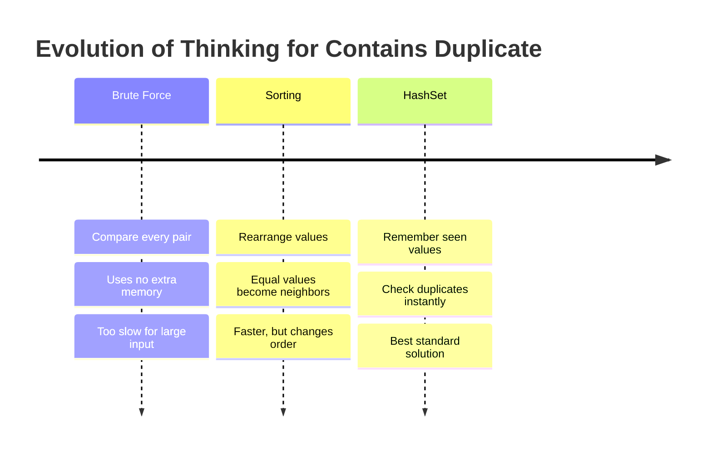
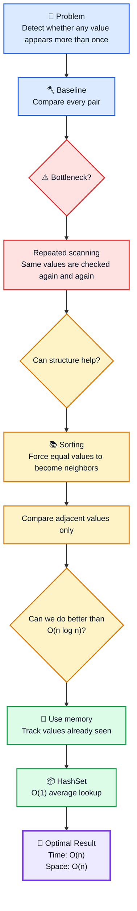
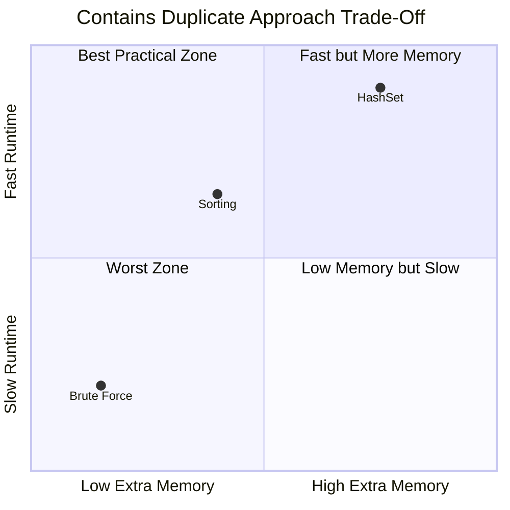
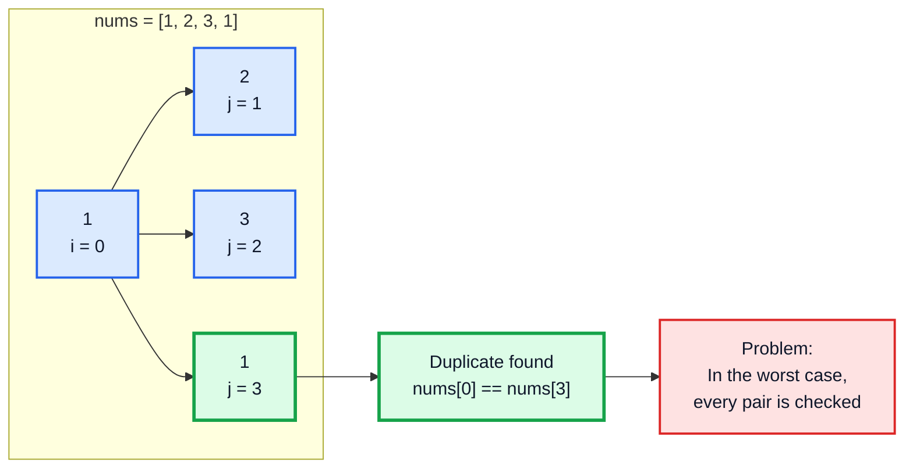
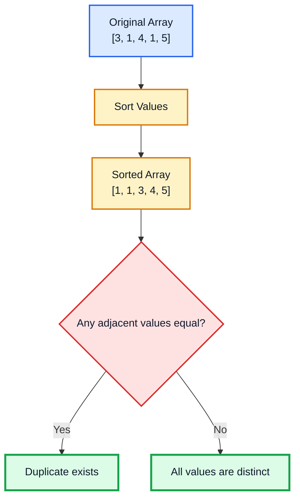
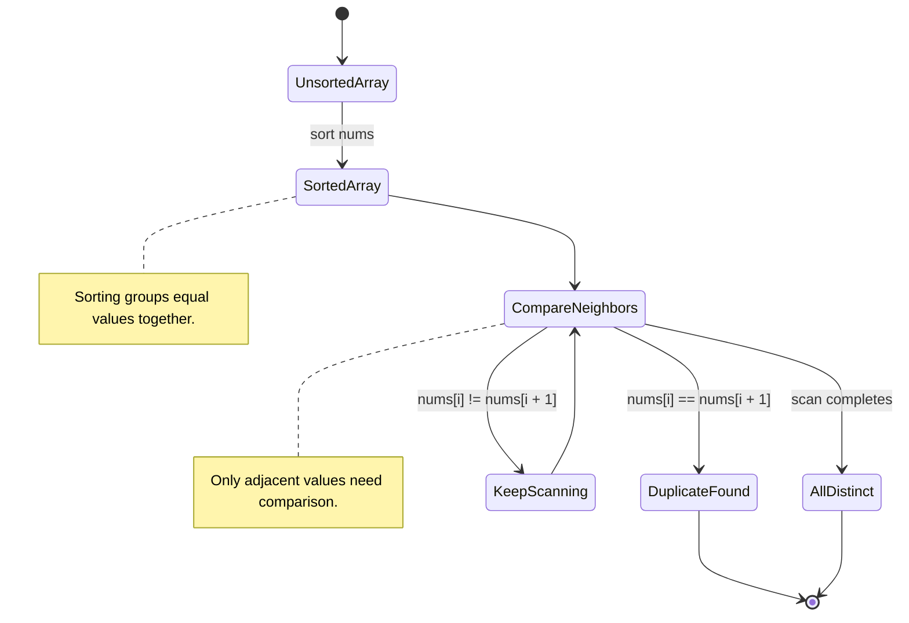
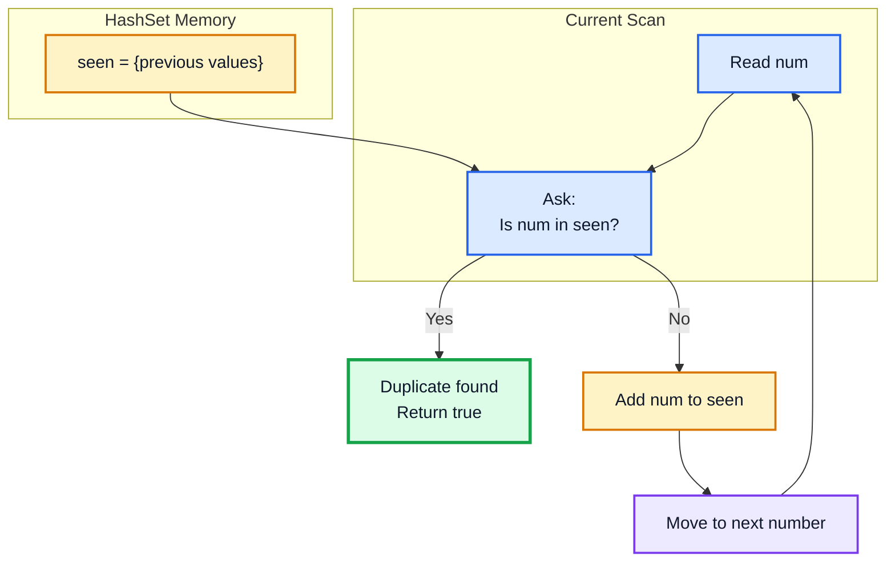
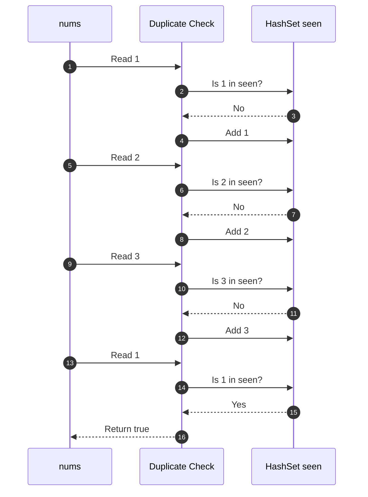
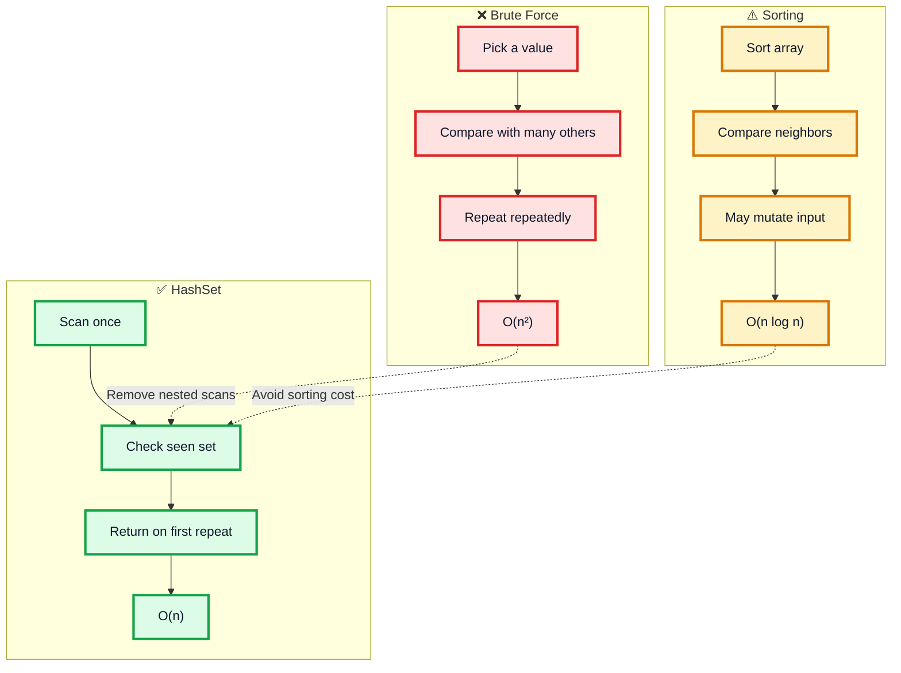
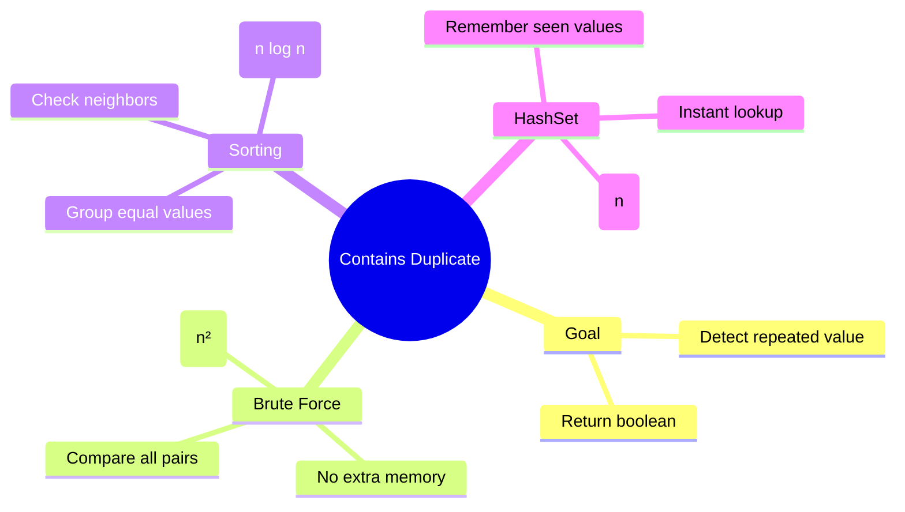

# LeetCode #217: Contains Duplicate — Strategic Study Guide

> **Problem Link:** [LeetCode #217 — Contains Duplicate](https://leetcode.com/problems/contains-duplicate/)

---

## Problem

Given an integer array `nums`, return `true` if any value appears at least twice in the array.

Return `false` if every element is distinct.

---

## Example

```text
Input:
nums = [1, 2, 3, 1]

Output:
true

Explanation:
The value 1 appears more than once.
```

```text
Input:
nums = [1, 2, 3, 4]

Output:
false

Explanation:
Every element is distinct.
```

---

## Rules

- A duplicate exists if any value appears at least twice.
- If all elements are unique, return `false`.
- Return type is Boolean:

```text
true / false
```

---

# Core Insight

This problem is about detecting repeated values.

The direct question is:

```text
Have I seen this number before?
```

If yes, then a duplicate exists.

If no, remember the number and continue scanning.

---

# Problem-Solving Evolution



---

# Strategic Decision Flow



---

# Approach Trade-Off



---

# High-Level Comparison

| Approach | Core Strategy | Time | Space | Verdict |
|---|---|---:|---:|---|
| Brute Force | Compare all pairs | `O(n²)` | `O(1)` | Simple but slow |
| Sorting | Sort, then compare neighbors | `O(n log n)` | `O(1)` or `O(n)` | Better, but may modify input |
| HashSet | Store seen values and check instantly | `O(n)` | `O(n)` | Best standard solution |

---

# 1. Brute Force Approach

## Idea

Compare every element with every other element after it.

If any two values are equal, return `true`.

This is the simplest possible solution, but it does too much repeated work.

---

## Visual Logic



---

## Algorithm

1. Use an outer loop at index `i`.
2. Use an inner loop at index `j = i + 1`.
3. Compare:

```python
nums[i] == nums[j]
```

4. If equal, return `True`.
5. If no duplicate is found, return `False`.

---

## Code

```python
from typing import List


class Solution:
    def containsDuplicate_brute_force(self, nums: List[int]) -> bool:
        n = len(nums)

        for i in range(n):
            for j in range(i + 1, n):
                if nums[i] == nums[j]:
                    return True

        return False
```

---

## Complexity

```text
Time:  O(n²)
Space: O(1)
```

---

## Weakness

The nested loop creates too many comparisons.

If the array is large and all elements are distinct, the algorithm must check almost every possible pair.

That makes it inefficient for large inputs.

---

# 2. Sorting Approach

## Idea

If duplicate values exist, sorting forces them to stand next to each other.

Example:

```text
Before sorting:
[3, 1, 4, 1, 5]

After sorting:
[1, 1, 3, 4, 5]
```

Now duplicate detection becomes simple:

```text
Check neighboring values.
```

---

## Sorting Transformation



---

## State View



---

## Algorithm

1. Sort the array.
2. Loop from index `0` to `n - 2`.
3. Compare each value with its next neighbor:

```python
nums[i] == nums[i + 1]
```

4. If equal, return `True`.
5. If the scan completes, return `False`.

---

## Code

```python
from typing import List


class Solution:
    def containsDuplicate_sorting(self, nums: List[int]) -> bool:
        nums.sort()

        for i in range(len(nums) - 1):
            if nums[i] == nums[i + 1]:
                return True

        return False
```

---

## Complexity

```text
Time:  O(n log n)
Space: O(1) or O(n), depending on sorting implementation
```

---

## Weakness

Sorting improves runtime compared to brute force, but it has two issues:

1. It may modify the original input order.
2. It is still slower than the HashSet approach.

If we can use extra memory, we can solve the problem in linear time.

---

# 3. HashSet Approach

## Idea

Use a set to remember every value already seen.

For each number, ask:

```text
Have I seen this before?
```

If yes, return `true`.

If no, store it and keep going.

---

## HashSet Memory Model



---

## Walkthrough Example

Given:

```text
nums = [1, 2, 3, 1]
```



---

## Algorithm

1. Create an empty set:

```python
seen = set()
```

2. Iterate through every number in `nums`.
3. If the number is already in `seen`, return `True`.
4. Otherwise, add the number to `seen`.
5. If the loop finishes, return `False`.

---

## Code

```python
from typing import List


class Solution:
    def containsDuplicate(self, nums: List[int]) -> bool:
        seen = set()

        for num in nums:
            if num in seen:
                return True

            seen.add(num)

        return False
```

---

## Complexity

```text
Time:  O(n)
Space: O(n)
```

---

## Why HashSet Is Optimal

The brute force approach repeatedly searches through the array.

The sorting approach rearranges the array to make duplicates easier to find.

The HashSet approach avoids both problems.

It remembers values as it scans, allowing duplicate checks in average constant time.



---

# Common Mistakes

## 1. Returning `False` Too Early

Incorrect idea:

```python
for num in nums:
    if num not in seen:
        return False
```

This is wrong because one unique value does not prove that the entire array is distinct.

You can only return `False` after scanning all elements.

---

## 2. Sorting When Input Order Matters

The sorting approach can modify the original array:

```python
nums.sort()
```

If the original order must be preserved, use:

```python
sorted_nums = sorted(nums)
```

or prefer the HashSet approach.

---

## 3. Confusing Set With Dictionary

For this problem, we only need to know whether a value exists.

So a set is enough:

```python
seen = set()
```

A dictionary is unnecessary unless we need counts or indices.

---

# Interview Explanation

```text
I would first consider the brute force solution, where every pair is compared.
That takes O(n²) time and O(1) space.

The bottleneck is repeated comparison.

A better option is sorting. After sorting, duplicates become adjacent, so I only need to compare neighbors.
That takes O(n log n) time.

The optimal solution is to use a HashSet.
As I scan the array, I store each value I have already seen.
If I encounter a value that is already in the set, I return true immediately.
If I finish scanning without finding a repeat, I return false.

This gives O(n) time and O(n) space.
```

---

# Final Recommended Solution

```python
from typing import List


class Solution:
    def containsDuplicate(self, nums: List[int]) -> bool:
        seen = set()

        for num in nums:
            if num in seen:
                return True

            seen.add(num)

        return False
```

---

# Pythonic One-Liner

```python
from typing import List


class Solution:
    def containsDuplicate(self, nums: List[int]) -> bool:
        return len(nums) != len(set(nums))
```

## Why It Works

If duplicates exist, converting the list into a set removes repeated values.

So:

```text
len(nums) != len(set(nums))
```

means at least one duplicate was removed.

---

# Final Mental Model



---

# Key Takeaways

- Brute force proves correctness but is too slow.
- Sorting groups duplicates together.
- HashSet avoids both nested loops and sorting.
- The key question is:

```text
Have I seen this value before?
```

- The optimal standard solution uses:

```text
Time:  O(n)
Space: O(n)
```

---

# Pattern Learned

Contains Duplicate teaches the **Seen Set Pattern**.

```python
seen = set()

for item in collection:
    if item in seen:
        return True

    seen.add(item)

return False
```

Use this pattern when a problem asks whether something has appeared before.

Common use cases:

- duplicate detection
- repeated characters
- visited states
- cycle detection
- membership tracking
- uniqueness validation

---

# Final Thought

Contains Duplicate is simple, but it teaches a major algorithmic principle:

```text
If the question is "Have I seen this before?",
use memory to answer instantly.
```
