# 🔁 LeetCode #217 — Contains Duplicate

> **[Open on LeetCode →](https://leetcode.com/problems/contains-duplicate/)**
> **Difficulty:** Easy | **Topic:** Array, Hash Set, Sorting

---

## 📋 Problem Statement

Given an integer array `nums`, return `true` if any value appears **at least twice** in the array.

Return `false` if every element is **distinct**.

---

## 📌 Examples

```
Input:  [1, 2, 3, 1]   →   true    (1 appears at index 0 and 3)
Input:  [1, 2, 3, 4]   →   false   (all elements are unique)
Input:  [1, 1, 1, 3, 3, 4, 3, 2, 4, 2]   →   true
```

---

## 🗺️ Understanding the Problem First

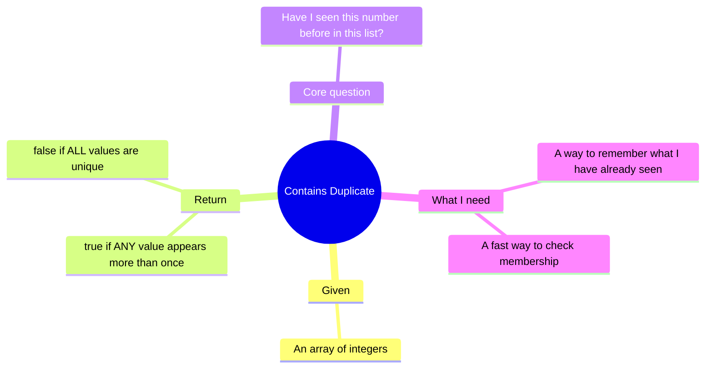

---

## 🧭 The Two Phases of Solving

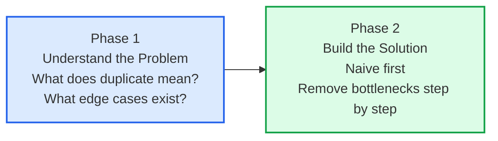

---

## 🔑 Core Insight Before Any Code

This is a **membership detection** problem. The one question we answer repeatedly is:

```
"Have I seen this number before?"
```

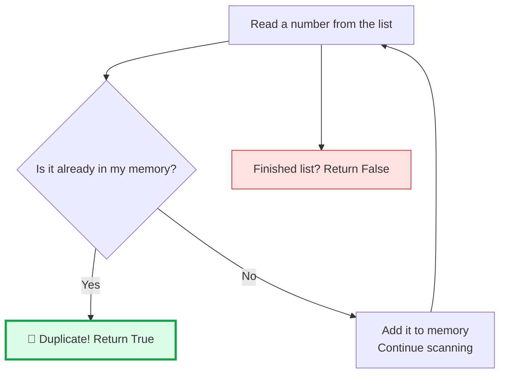

---

## 📊 Solution Progression Overview

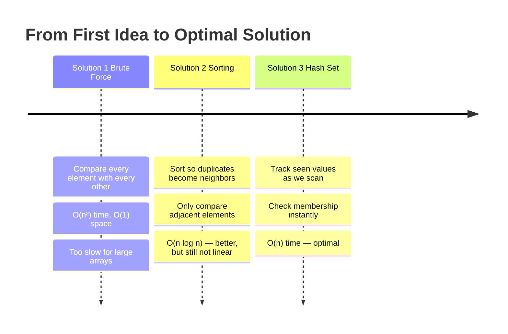

---
---

# ✏️ Solution 1 — Brute Force

## Thinking From This Perspective

**My starting thought:** *"I need to know if any two elements are equal. The simplest thing: pick each element, compare it to every element after it. If any two match, return true."*

No data structures needed. Just two loops.

---

## Visual — What Brute Force Does

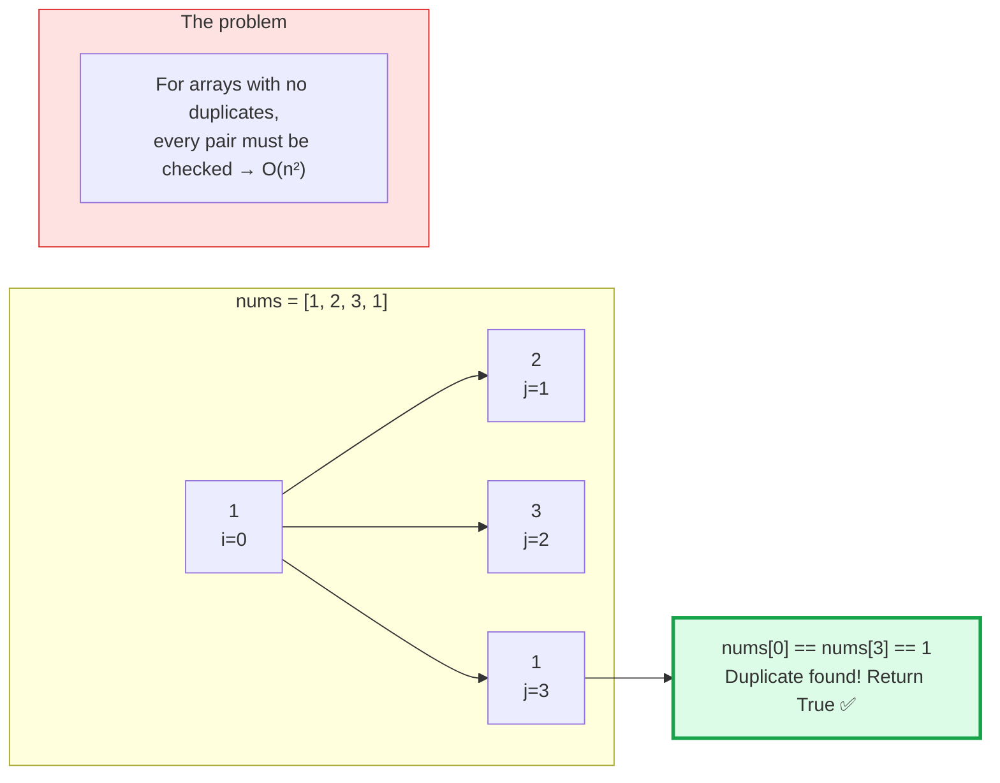

---

## Complexity

```
Time:  O(n²)  — every element is compared with every element after it
Space: O(1)   — no extra data structures
```

---

## ✅ Full LeetCode Solution — Brute Force

```python
from typing import List


class Solution:
    def containsDuplicate(self, nums: List[int]) -> bool:
        n = len(nums)

        for i in range(n):                     # fix one element
            for j in range(i + 1, n):          # compare with every element after it
                if nums[i] == nums[j]:
                    return True                # duplicate found

        return False                           # no duplicates found
```

---

## Why I Move to the Next Solution

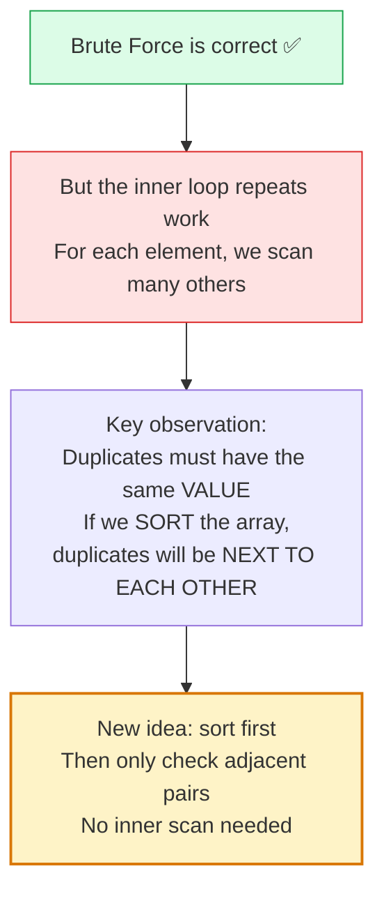

---
---

# ✏️ Solution 2 — Sorting

## Thinking From This Perspective

**My new thought:** *"Duplicates are equal values. If equal values are guaranteed to be neighbors after sorting, I only need to check adjacent pairs — no inner loop at all."*

```
Before sort: [3, 1, 4, 1, 5]
After sort:  [1, 1, 3, 4, 5]
                ↑↑
           duplicates are now adjacent
```

---

## Visual — Sorting Brings Duplicates Together

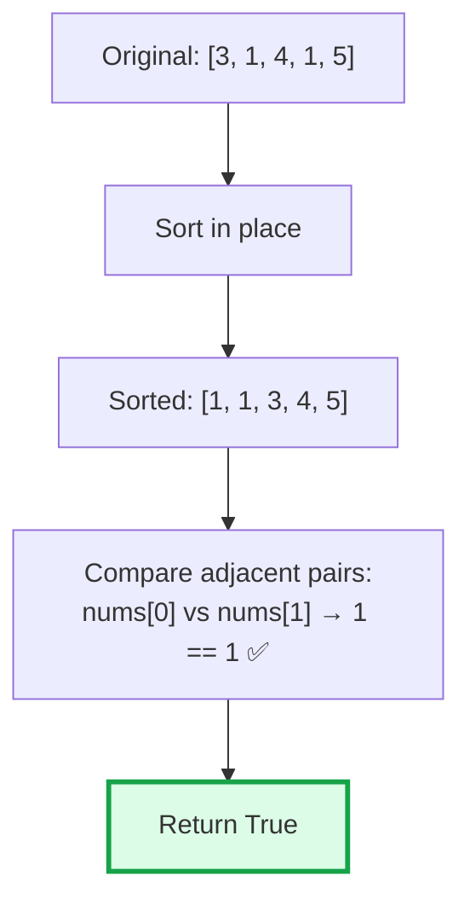

---

## State View of the Algorithm

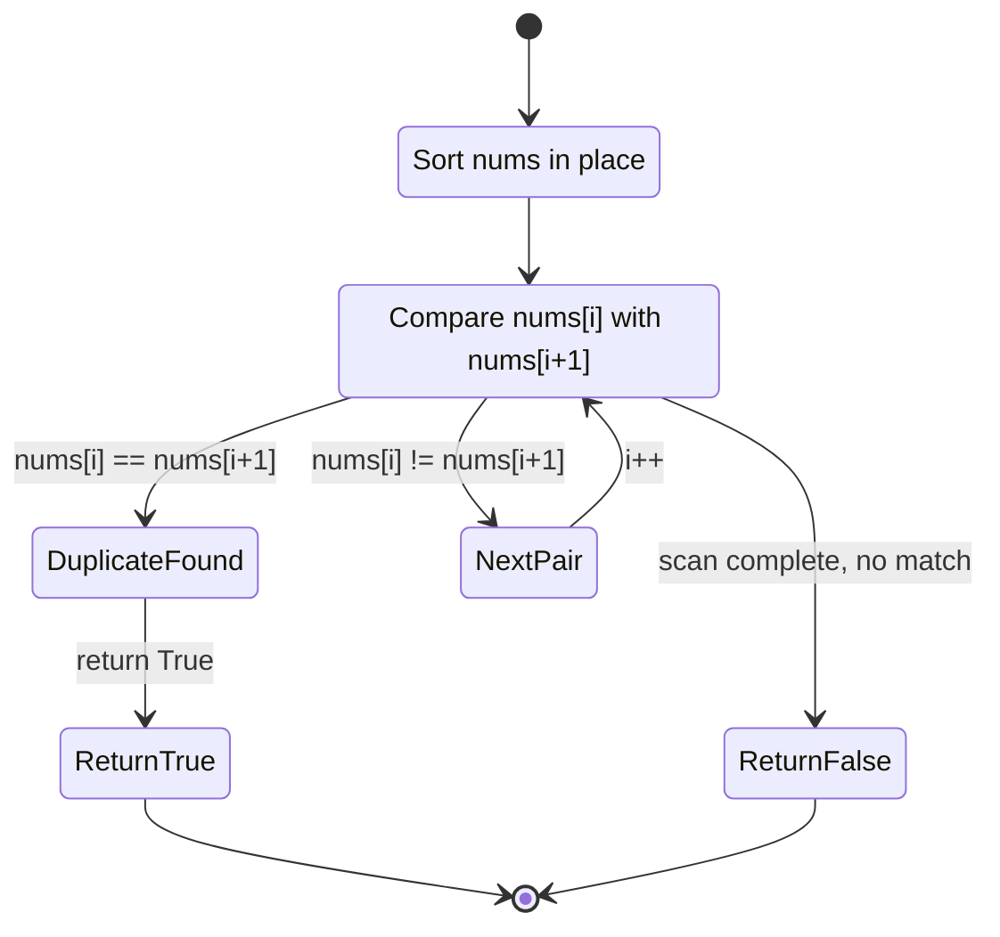

---

## Complexity

```
Time:  O(n log n)  — dominated by sorting
Space: O(1)        — sort in place (or O(n) if input must be preserved)
```

---

## ✅ Full LeetCode Solution — Sorting

```python
from typing import List


class Solution:
    def containsDuplicate(self, nums: List[int]) -> bool:
        nums.sort()                            # bring equal values next to each other

        for i in range(len(nums) - 1):         # check each adjacent pair
            if nums[i] == nums[i + 1]:
                return True                    # neighbors are equal → duplicate

        return False                           # all neighbors differ → no duplicates
```

---

## Why I Move to the Next Solution

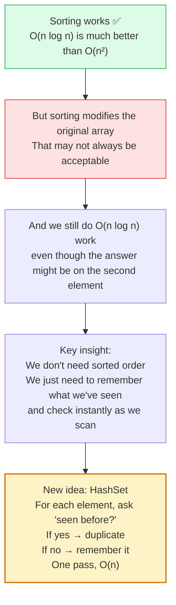

---
---

# ✏️ Solution 3 — Hash Set (Optimal)

## Thinking From This Perspective

**My final thought:** *"I don't need to sort anything. As I scan left to right, I keep a set of everything I've already seen. For each new number — is it already in the set? If yes: duplicate. If no: add it and continue. One pass. Done."*

---

## Visual — How the Set Grows

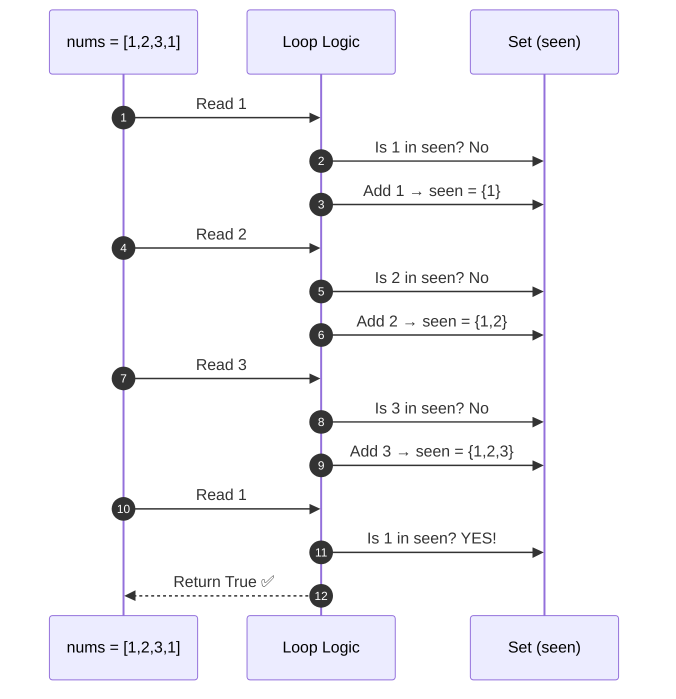

---

## Internal Set Mechanics (Simplified)

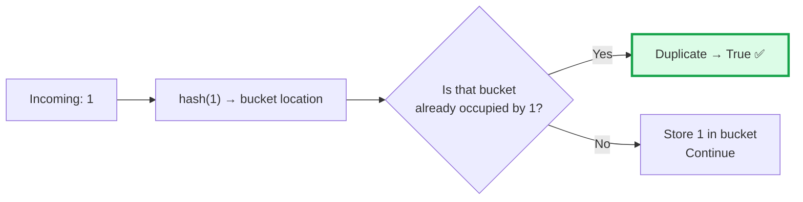

A Python `set` resolves membership in **O(1) average time** regardless of how many items are in it.

---

## Complexity

```
Time:  O(n)   — single pass, O(1) set lookup per element
Space: O(n)   — set grows to at most n elements
```

---

## ✅ Full LeetCode Solution — Hash Set

```python
from typing import List


class Solution:
    def containsDuplicate(self, nums: List[int]) -> bool:
        seen = set()                   # our memory of visited values

        for num in nums:
            if num in seen:            # have we seen this before?
                return True
            seen.add(num)              # no → remember it

        return False                   # scanned everything, no duplicate
```

---

## Bonus — Pythonic One-Liner

```python
from typing import List


class Solution:
    def containsDuplicate(self, nums: List[int]) -> bool:
        return len(nums) != len(set(nums))
```

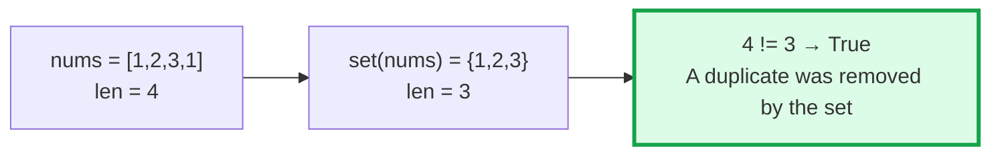

---

## Full Comparison

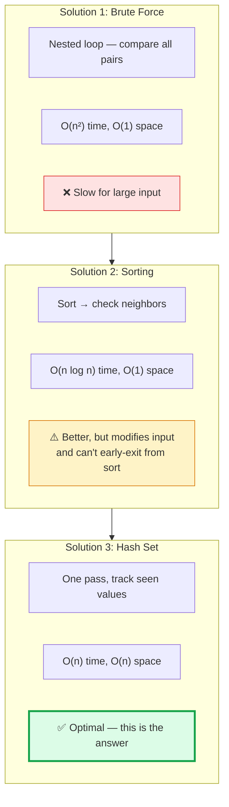

---

## 🔁 The Reusable Pattern

```python
# Seen Set Pattern — use whenever the question is "have I seen this before?"
seen = set()
for item in collection:
    if item in seen:
        return True          # revisit / duplicate detected
    seen.add(item)
return False
```

Apply this pattern to: **duplicate detection, cycle detection, visited-state tracking, uniqueness checks.**

---

## ✅ Final Takeaways

```
1. This is a membership detection problem
2. One key question: "Have I seen this before?"
3. A set answers that in O(1)
4. Progression: O(n²) → O(n log n) → O(n)
5. Each step removes one unnecessary scan
```

> 💡 Whenever a problem asks "has this appeared before?" — reach for a set.
