# 🔤 LeetCode #242 — Valid Anagram

> **[Open on LeetCode →](https://leetcode.com/problems/valid-anagram/)**
> **Difficulty:** Easy | **Topic:** String, Hash Map, Sorting

---

## 📋 Problem Statement

Given two strings `s` and `t`, return `true` if `t` is an **anagram** of `s`, and `false` otherwise.

An **anagram** is a word formed by rearranging the letters of another word, using all original letters **exactly once**.

**Constraints:**
```
1 <= s.length, t.length <= 5 * 10^4
s and t consist of lowercase English letters only
```

**Follow-up:** What if the inputs contain Unicode characters?

---

## 📌 Examples

```
Input:  s = "anagram",  t = "nagaram"   →   true
Reason: Same letters, same counts — just rearranged

Input:  s = "rat",  t = "car"           →   false
Reason: 'rat' has 't', 'car' has 'c' — different characters

Input:  s = "aa",  t = "a"              →   false
Reason: Same character but different frequency
```

---

## 🗺️ Understanding the Problem First

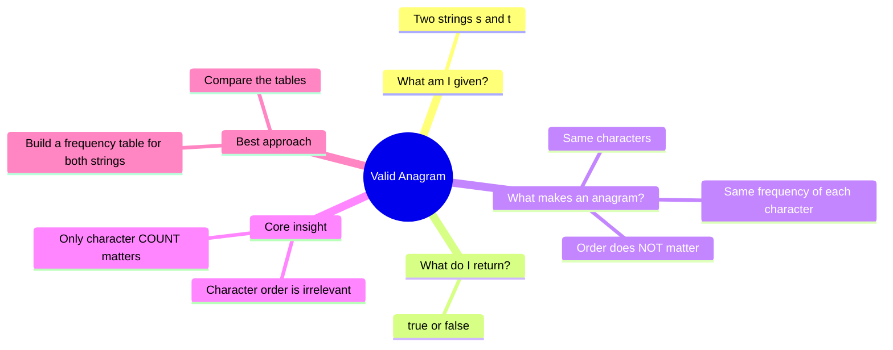

---

## 🧭 The Two Phases of Solving

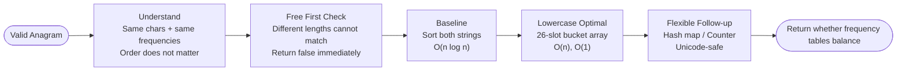

---

## 🔑 Core Insight Before Any Code

```
"anagram"  counts as: { a:3, n:1, g:1, r:1, m:1 }
"nagaram"  counts as: { a:3, n:1, g:1, r:1, m:1 }

Tables are identical → True ✅

"rat"  counts as: { r:1, a:1, t:1 }
"car"  counts as: { c:1, a:1, r:1 }

Tables differ (t vs c) → False ❌
```

The order letters appear in does not matter. Only **how many times each letter appears** matters.

---

## ⚡ The Always-First Check: Length

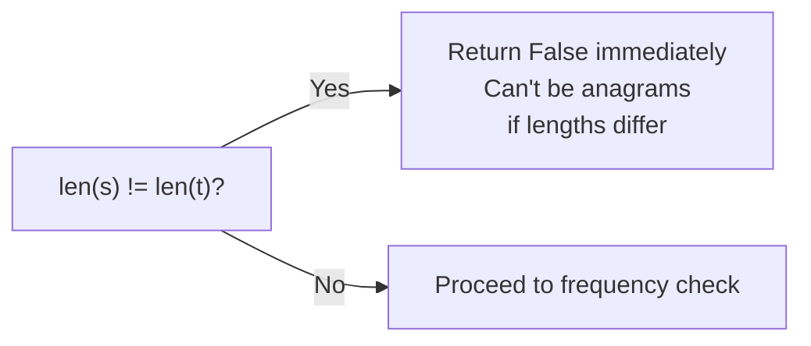

This is a free O(1) optimization that eliminates many inputs immediately.

---

## 📊 Solution Progression Overview

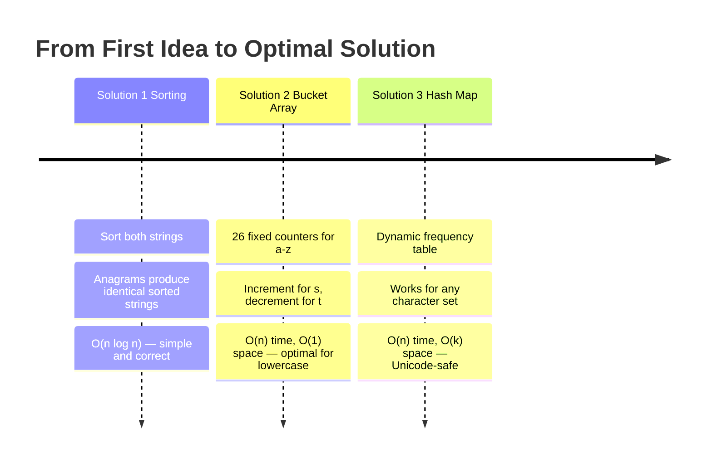

---
---

# ✏️ Solution 1 — Sorting

## Thinking From This Perspective

**My starting thought:** *"If two strings are anagrams, they contain the same letters. Sorting both strings rearranges letters into the same order. If they're anagrams, their sorted forms must be identical. I can just compare them."*

```
s = "anagram" → sort → "aaagmnr"
t = "nagaram" → sort → "aaagmnr"

"aaagmnr" == "aaagmnr" → True ✅
```

---

## Visual — Sorting Normalizes Both Strings

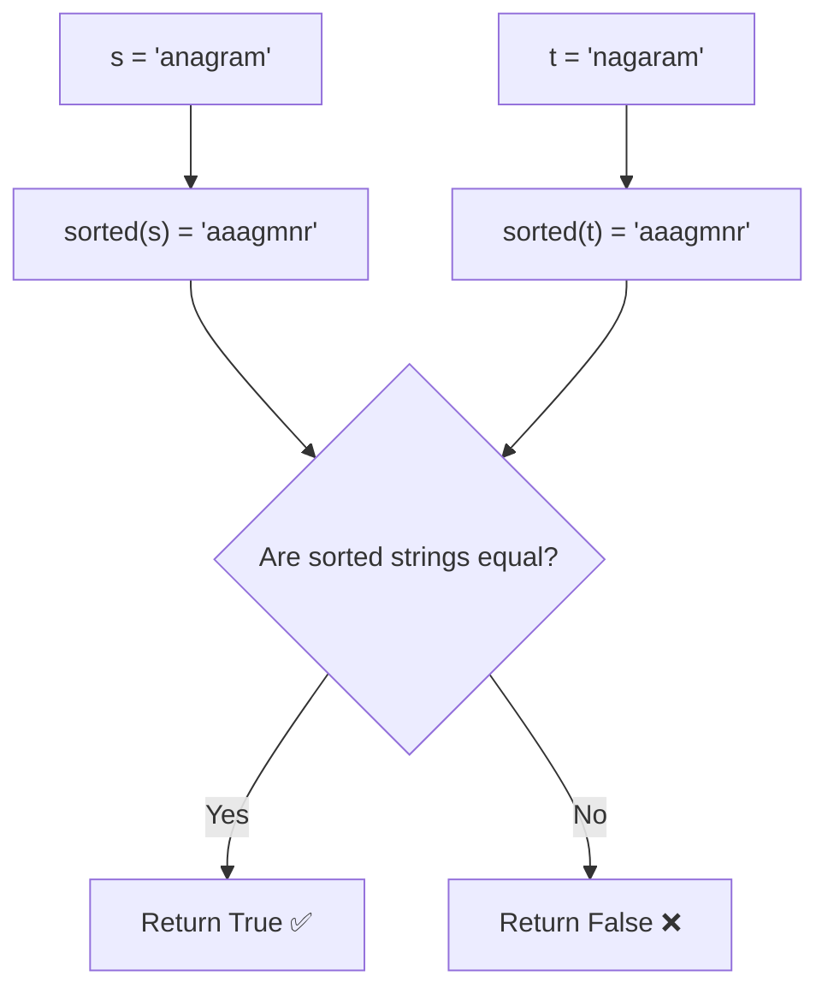

---

## Both Cases Side by Side

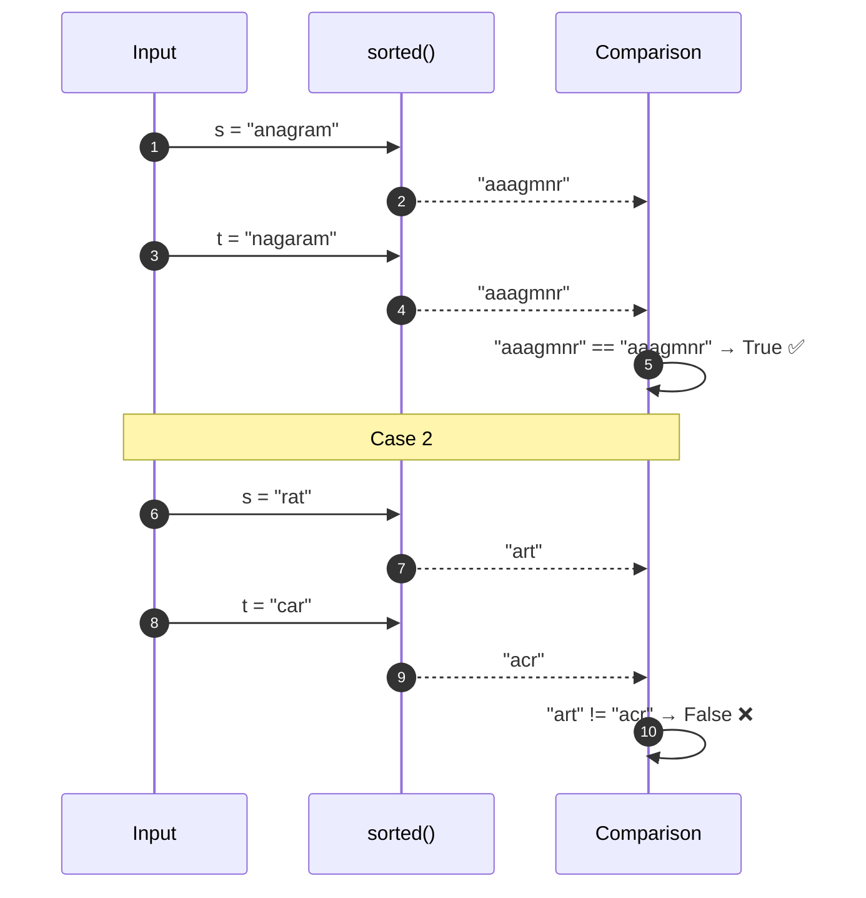

---

## Complexity

```
Time:  O(n log n)  — sorting both strings
Space: O(n)        — Python's sorted() creates new list objects
```

---

## ✅ Full LeetCode Solution — Sorting

```python
class Solution:
    def isAnagram(self, s: str, t: str) -> bool:
        if len(s) != len(t):                # quick early exit
            return False

        return sorted(s) == sorted(t)       # anagrams sort to the same string
```

---

## Why I Move to the Next Solution

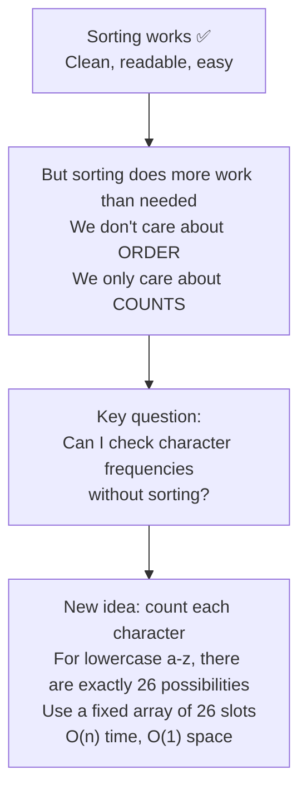

---
---

# ✏️ Solution 2 — Bucket Array (26 Fixed Counters)

## Thinking From This Perspective

**My new thought:** *"There are only 26 lowercase letters. I can give each letter a slot in a fixed-size array. For each character in s, increment its slot. For each character in t, decrement its slot. If s and t are anagrams, every slot returns to zero."*

Formula to map a letter to its index:
```
index = ord(char) - ord('a')

'a' → 0
'b' → 1
...
'z' → 25
```

---

## Visual — Mapping Letters to Buckets

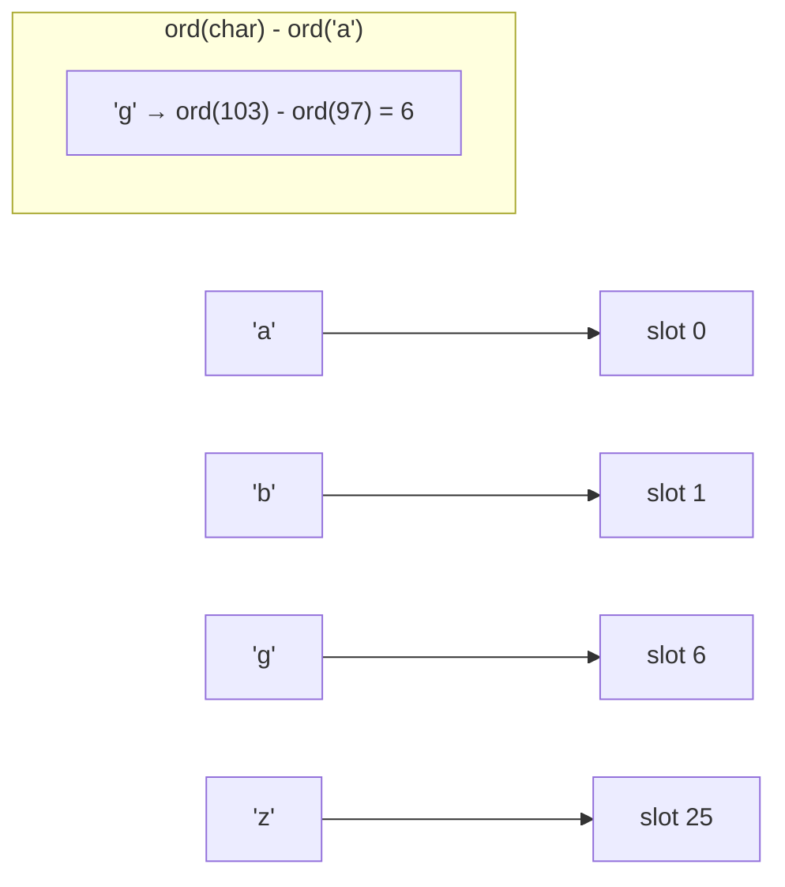

---

## Balance Strategy — Increment s, Decrement t

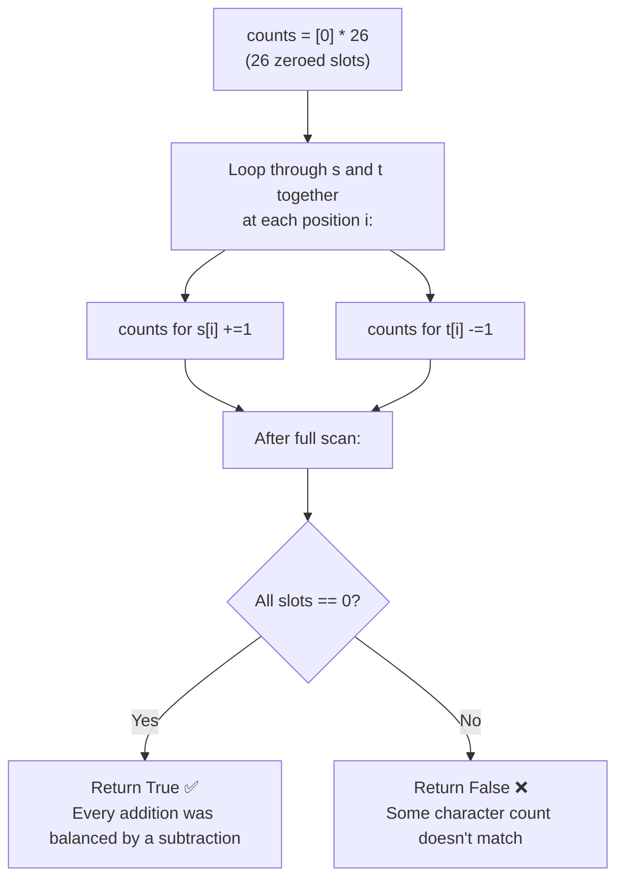

---

## Walkthrough on "anagram" / "nagaram"

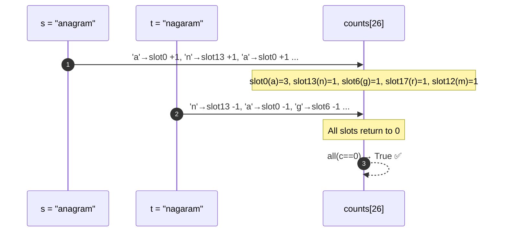

---

## Complexity

```
Time:  O(n)   — one pass through both strings simultaneously
Space: O(1)   — always exactly 26 slots, regardless of input size
```

---

## ✅ Full LeetCode Solution — Bucket Array

```python
class Solution:
    def isAnagram(self, s: str, t: str) -> bool:
        if len(s) != len(t):                         # quick early exit
            return False

        counts = [0] * 26                            # one slot for each letter a–z

        for i in range(len(s)):
            counts[ord(s[i]) - ord('a')] += 1        # s adds to its letter's slot
            counts[ord(t[i]) - ord('a')] -= 1        # t removes from its letter's slot

        return all(count == 0 for count in counts)   # balanced = anagram
```

---

## Why I Move to the Next Solution

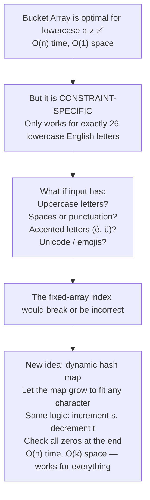

---
---

# ✏️ Solution 3 — Hash Map (Unicode-Safe, Flexible)

## Thinking From This Perspective

**My final thought:** *"Same idea as the bucket array, but instead of a fixed 26-slot array, I use a dictionary keyed by the actual character. This handles any alphabet — lowercase, uppercase, Unicode, emojis. The logic is identical: +1 for s, -1 for t, check all zeros."*

---

## Visual — Dynamic Frequency Map

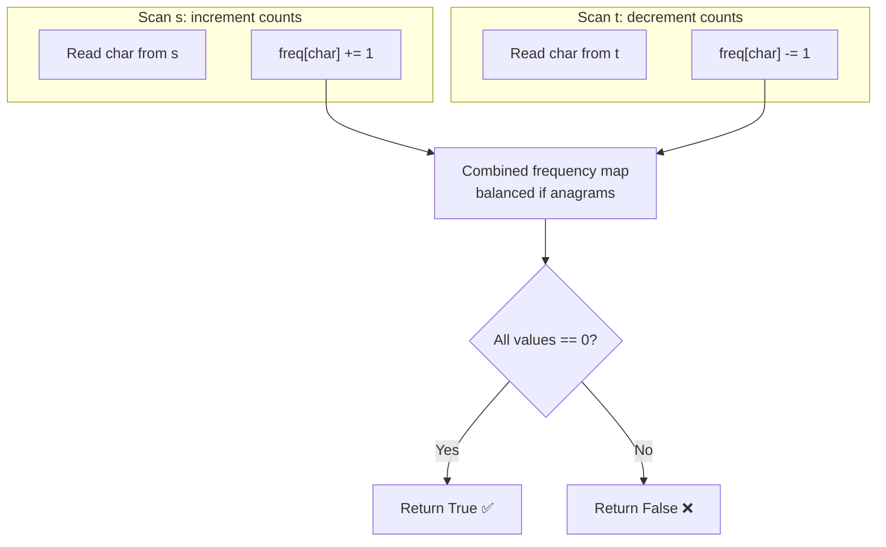

---

## Walkthrough on "rat" / "car" (Non-Anagram)

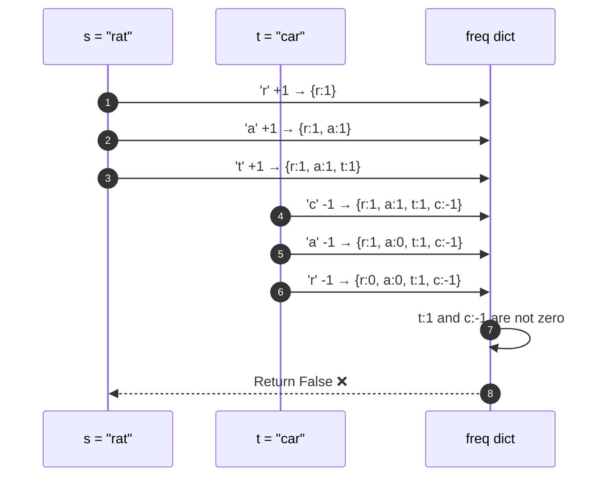

---

## Complexity

```
Time:  O(n)   — one pass through both strings
Space: O(k)   — k = number of unique characters in s and t combined
               For lowercase a-z: k ≤ 26
               For Unicode: k can be larger but bounded by input
```

---

## ✅ Full LeetCode Solution — Hash Map

```python
class Solution:
    def isAnagram(self, s: str, t: str) -> bool:
        if len(s) != len(t):                          # quick early exit
            return False

        freq = {}                                     # dynamic character frequency map

        for i in range(len(s)):
            freq[s[i]] = freq.get(s[i], 0) + 1       # increment for s
            freq[t[i]] = freq.get(t[i], 0) - 1       # decrement for t

        return all(v == 0 for v in freq.values())     # balanced = anagram
```

---

## Bonus — Pythonic Counter One-Liner

```python
from collections import Counter


class Solution:
    def isAnagram(self, s: str, t: str) -> bool:
        return Counter(s) == Counter(t)
```

`Counter` builds the frequency map automatically. Two Counters are equal only if every key has the same count in both — exactly what we need.

---

## Full Comparison of All Three Solutions

```mermaid
quadrantChart
    title Valid Anagram Approach Trade-Off Map
    x-axis Lowercase Only --> Any Character Set
    y-axis Slower Runtime --> Faster Runtime
    quadrant-1 Fast and universal
    quadrant-2 Fast but constraint-specific
    quadrant-3 Slow and limited
    quadrant-4 Flexible but slower
    Sorting O(n log n), general: [0.80, 0.42]
    26-Bucket Array O(n), O(1): [0.18, 0.96]
    Hash Map O(n), Unicode-safe: [0.88, 0.90]
    Counter One-Liner O(n), readable: [0.94, 0.84]
```

---

## Approach Trade-Off Map


---

## 🔁 The Reusable Pattern

```python
# Frequency Counting Pattern
freq = {}
for ch in first_string:
    freq[ch] = freq.get(ch, 0) + 1      # count up
for ch in second_string:
    freq[ch] = freq.get(ch, 0) - 1      # count down
return all(v == 0 for v in freq.values())  # balanced = match
```

Apply this pattern to: **anagram detection, frequency comparison, inventory matching, multiset equality, character distribution problems.**

---

## ✅ Final Takeaways

```
1. Anagram = same characters with same frequencies (order does NOT matter)
2. Always check lengths first — O(1) early exit
3. Sorting works but O(n log n) is unnecessary when you only need counts
4. Bucket array: O(n) time, O(1) space — best for lowercase a-z
5. Hash map: O(n) time, O(k) space — works for any character set
6. Progression: O(n log n) → O(n) with O(1) space → O(n) with any charset
```

> 💡 When the question is *"do these two collections contain the same stuff?"* — count frequencies and compare the tables.
