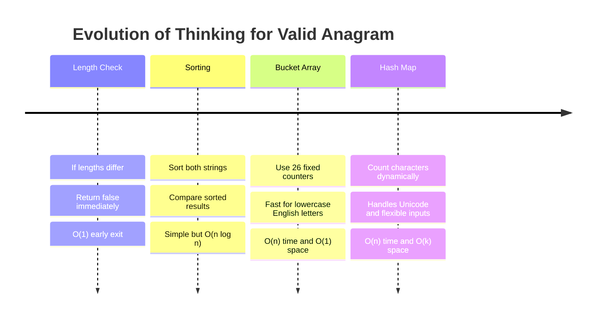
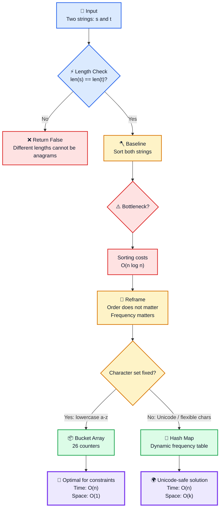
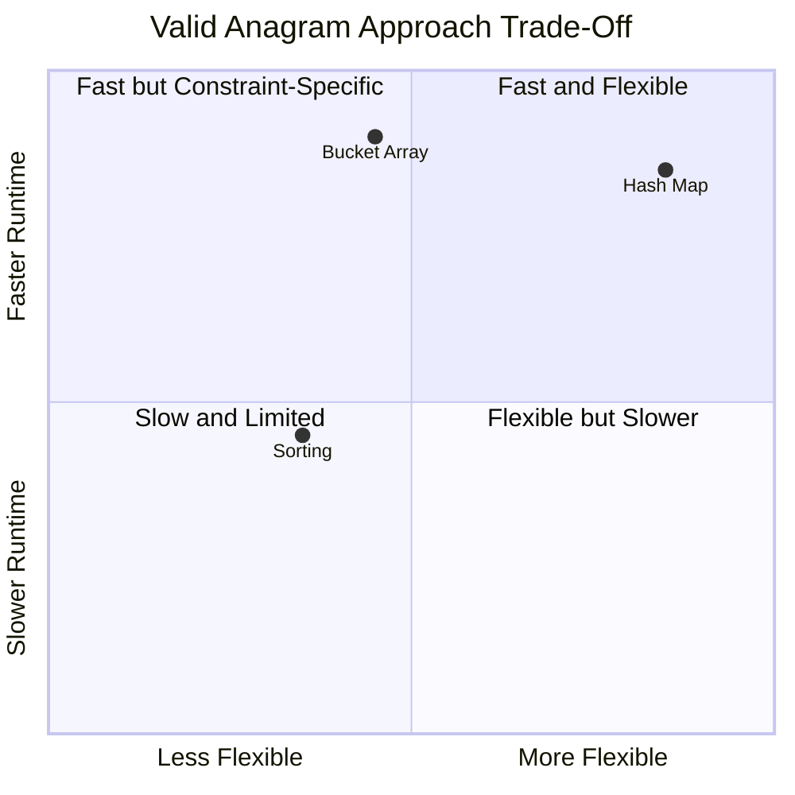
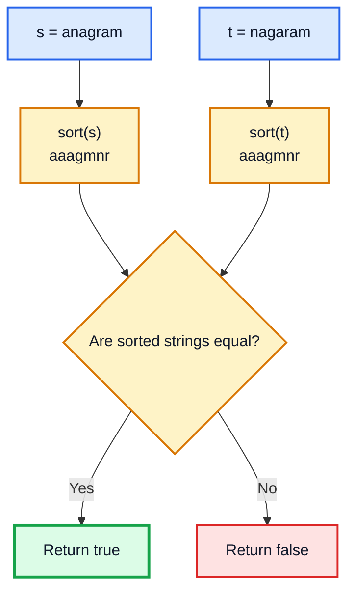
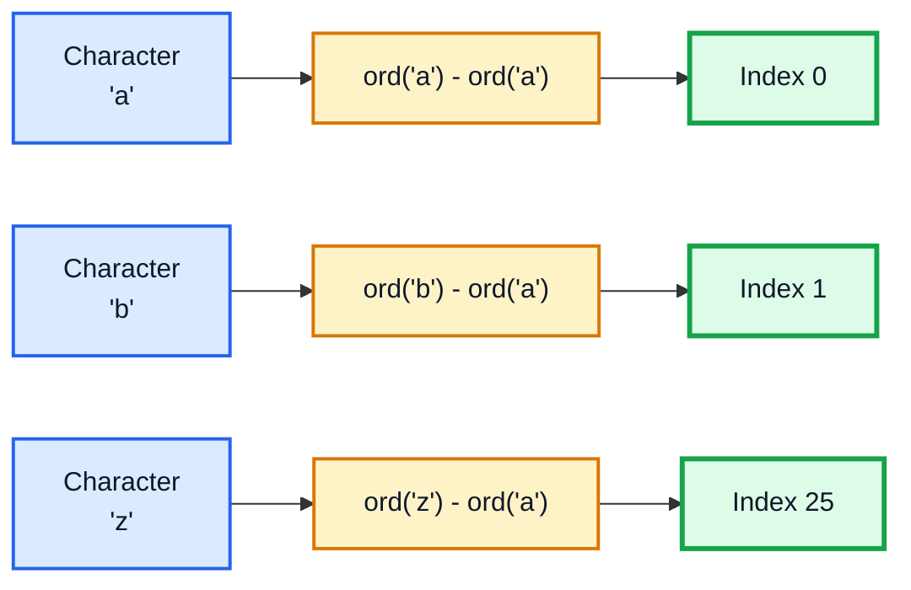
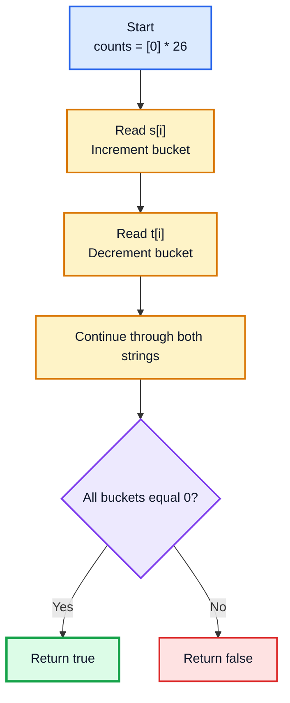
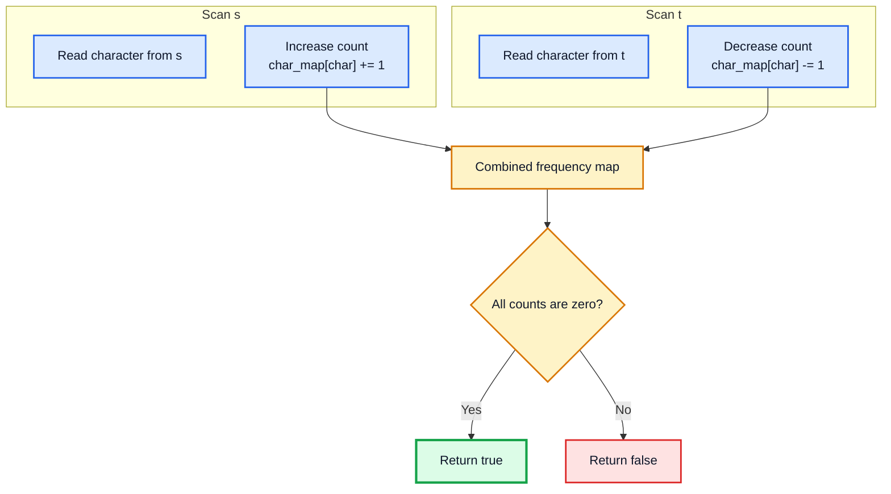
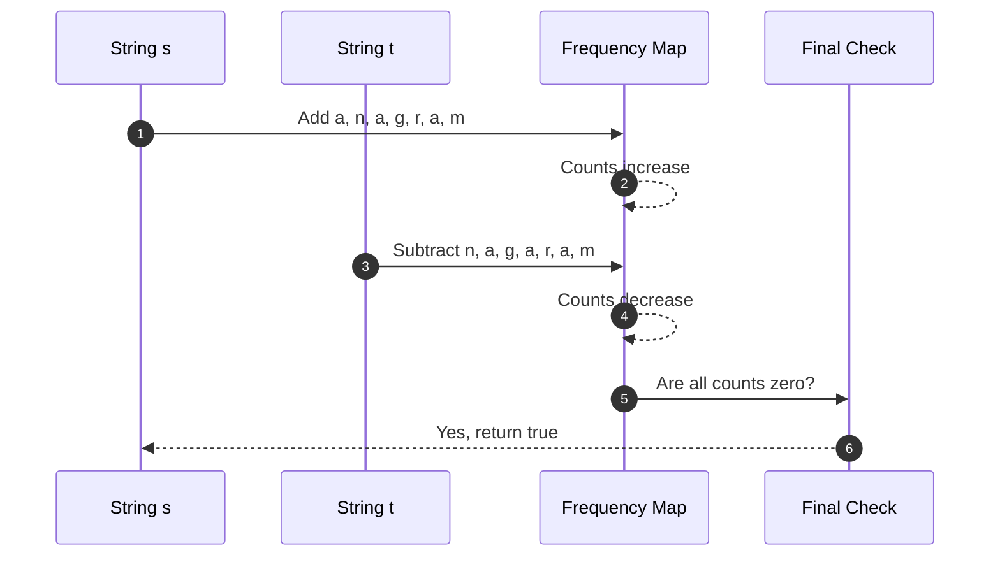
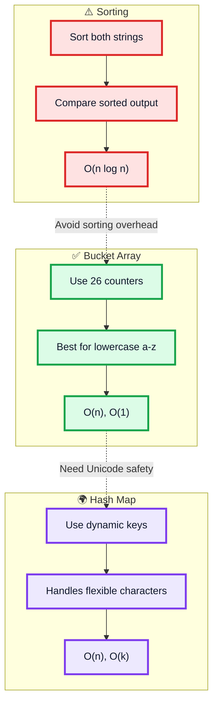
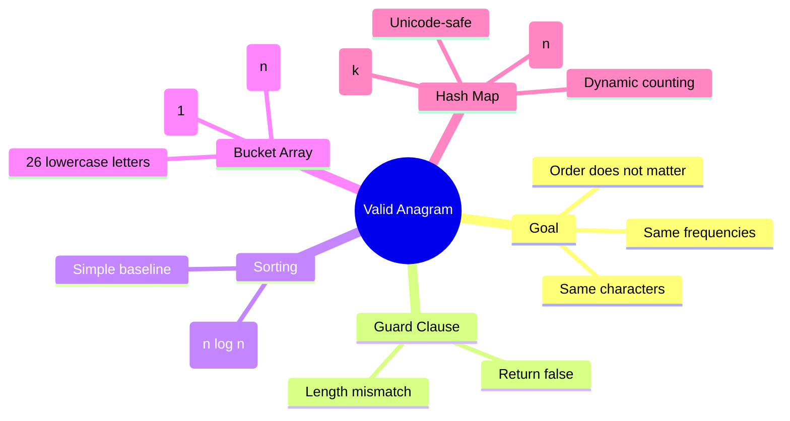

# LeetCode #242: Valid Anagram — Strategic Study Guide

> **Problem Link:** [LeetCode #242 — Valid Anagram](https://leetcode.com/problems/valid-anagram/)

---

## Problem

Given two strings `s` and `t`, return `true` if `t` is an anagram of `s`.

Return `false` otherwise.

---

## Example

```text
Input:
s = "anagram"
t = "nagaram"

Output:
true

Explanation:
Both strings contain the same characters with the same frequencies.
```

```text
Input:
s = "rat"
t = "car"

Output:
false

Explanation:
The strings contain different characters.
```

---

## Rules

An anagram is formed by rearranging the letters of another word or phrase using all original characters exactly once.

So, `t` is an anagram of `s` if:

```text
Both strings contain the exact same characters
with the exact same frequencies.
```

---

## Constraints

```text
1 <= s.length, t.length <= 5 * 10^4
s and t consist of lowercase English letters.
```

Follow-up:

```text
What if the inputs contain Unicode characters?
```

---

# Core Insight

The order of characters does not matter.

Only character frequency matters.

```text
"anagram"  → a:3, n:1, g:1, r:1, m:1
"nagaram"  → a:3, n:1, g:1, r:1, m:1
```

Because the frequency tables match, the strings are anagrams.

---

# Problem-Solving Evolution



---

# Strategic Decision Flow



---

# Approach Trade-Off



---

# High-Level Comparison

| Approach | Core Strategy | Time | Space | Verdict |
|---|---|---:|---:|---|
| Sorting | Sort both strings and compare | `O(n log n)` | `O(n)` in Python | Simple but not optimal |
| Bucket Array | Count lowercase letters using 26 slots | `O(n)` | `O(1)` | Best for lowercase English constraints |
| Hash Map | Count characters dynamically | `O(n)` | `O(k)` | Best for Unicode and flexible inputs |

---

# 1. Sorting Approach

## Idea

If two strings are anagrams, sorting both strings will produce the same ordered sequence.

Example:

```text
s = "anagram" → "aaagmnr"
t = "nagaram" → "aaagmnr"
```

Since the sorted versions match, the strings are anagrams.

---

## Sorting Logic



---

## Algorithm

1. If the lengths differ, return `False`.
2. Sort both strings.
3. Compare the sorted results.
4. If they match, return `True`.
5. Otherwise, return `False`.

---

## Code

```python
class Solution:
    def isAnagram_sorting(self, s: str, t: str) -> bool:
        if len(s) != len(t):
            return False

        return sorted(s) == sorted(t)
```

---

## Complexity

```text
Time:  O(n log n)
Space: O(n) in Python because sorted() creates new lists
```

---

## Weakness

Sorting does more work than necessary.

We do not need characters to be ordered.

We only need to know whether their frequencies match.

---

# 2. Fixed Bucket Array Approach

## Idea

Since the standard constraint says the strings contain lowercase English letters, there are only 26 possible characters.

We can map each character to an index:

```text
a → 0
b → 1
c → 2
...
z → 25
```

Formula:

```text
index = ord(char) - ord('a')
```

---

## Bucket Array Memory Model



---

## Balance Strategy

For every position:

- Add `+1` for the character from `s`.
- Add `-1` for the character from `t`.

If both strings are anagrams, every bucket returns to zero.



---

## Algorithm

1. If lengths differ, return `False`.
2. Create an array of 26 zeros.
3. Loop through both strings at the same time.
4. Increment count for `s[i]`.
5. Decrement count for `t[i]`.
6. After scanning, check if every value is zero.

---

## Code

```python
class Solution:
    def isAnagram_bucket_array(self, s: str, t: str) -> bool:
        if len(s) != len(t):
            return False

        counts = [0] * 26

        for i in range(len(s)):
            counts[ord(s[i]) - ord('a')] += 1
            counts[ord(t[i]) - ord('a')] -= 1

        for count in counts:
            if count != 0:
                return False

        return True
```

---

## Complexity

```text
Time:  O(n)
Space: O(1)
```

The space is constant because the array always has exactly 26 slots.

---

## Weakness

This approach is fast but constraint-specific.

It assumes every character is lowercase English `a-z`.

It can break if inputs contain:

- uppercase letters
- spaces
- punctuation
- accented characters
- Unicode characters
- emojis

For flexible input, use a hash map.

---

# 3. Hash Map Approach

## Idea

Instead of relying on fixed character indexes, use a hash map to dynamically track character frequencies.

This works for lowercase English letters and also adapts better to Unicode or mixed character sets.

---

## Hash Map Frequency Model



---

## Walkthrough Example

Given:

```text
s = "anagram"
t = "nagaram"
```



---

## Algorithm

1. If lengths differ, return `False`.
2. Create an empty dictionary.
3. Loop through both strings.
4. Increment frequency for characters in `s`.
5. Decrement frequency for characters in `t`.
6. If every final count is zero, return `True`.
7. Otherwise, return `False`.

---

## Code

```python
class Solution:
    def isAnagram_hashmap(self, s: str, t: str) -> bool:
        if len(s) != len(t):
            return False

        char_map = {}

        for i in range(len(s)):
            char_map[s[i]] = char_map.get(s[i], 0) + 1
            char_map[t[i]] = char_map.get(t[i], 0) - 1

        for count in char_map.values():
            if count != 0:
                return False

        return True
```

---

## Complexity

```text
Time:  O(n)
Space: O(k)
```

Where:

```text
k = number of unique characters
```

---

## Why Hash Map Is the Most Flexible

The bucket array is excellent when the character set is fixed.

The hash map is safer when the character set may vary.



---

# Common Mistakes

## 1. Skipping the Length Check

If the lengths are different, the strings cannot be anagrams.

Always start with:

```python
if len(s) != len(t):
    return False
```

This saves unnecessary work.

---

## 2. Checking Only Unique Characters

Wrong idea:

```text
"aa" and "a" have the same unique character: a
```

But they are not anagrams because frequencies differ.

Anagrams require matching counts, not just matching character sets.

---

## 3. Using Bucket Array for Unicode Inputs

This works only for lowercase English letters:

```python
counts[ord(char) - ord('a')]
```

For Unicode or mixed inputs, use a dictionary or `Counter`.

---

## 4. Forgetting to Validate Final Counts

If using increment/decrement logic, every value must return to zero.

```python
for count in char_map.values():
    if count != 0:
        return False
```

---

# Interview Explanation

```text
I would first check whether the two strings have the same length.
If not, they cannot be anagrams.

A simple approach is to sort both strings and compare them.
That works because anagrams become identical after sorting, but sorting costs O(n log n).

To optimize, I can count character frequencies.
For lowercase English letters, I can use a fixed array of size 26.
I increment counts for characters in s and decrement counts for characters in t.
If all counts are zero, the strings are anagrams.

For Unicode or flexible character sets, I would use a hash map instead of a fixed array.
That gives O(n) time and O(k) space, where k is the number of unique characters.
```

---

# Final Recommended Solution

For the standard LeetCode constraint of lowercase English letters:

```python
class Solution:
    def isAnagram(self, s: str, t: str) -> bool:
        if len(s) != len(t):
            return False

        counts = [0] * 26

        for i in range(len(s)):
            counts[ord(s[i]) - ord('a')] += 1
            counts[ord(t[i]) - ord('a')] -= 1

        return all(count == 0 for count in counts)
```

---

# Unicode-Safe Version

For flexible or international inputs:

```python
class Solution:
    def isAnagram(self, s: str, t: str) -> bool:
        if len(s) != len(t):
            return False

        char_map = {}

        for i in range(len(s)):
            char_map[s[i]] = char_map.get(s[i], 0) + 1
            char_map[t[i]] = char_map.get(t[i], 0) - 1

        return all(count == 0 for count in char_map.values())
```

---

# Pythonic Version

```python
from collections import Counter


class Solution:
    def isAnagram(self, s: str, t: str) -> bool:
        return Counter(s) == Counter(t)
```

---

# Final Mental Model



---

# Key Takeaways

- Anagrams require identical character frequencies.
- Character order does not matter.
- The first check should be string length.
- Sorting is simple but slower.
- Bucket array is fastest under lowercase English constraints.
- Hash map is safer for Unicode or flexible character sets.

Core formula:

```text
same frequency table => valid anagram
```

---

# Pattern Learned

Valid Anagram teaches the **Frequency Counting Pattern**.

```python
freq = {}

for item in collection:
    freq[item] = freq.get(item, 0) + 1
```

Use this pattern when a problem involves:

- character counts
- word counts
- anagram detection
- frequency comparison
- inventory matching
- multiset equality

---

# Final Thought

Valid Anagram is not just a string problem.

It teaches a powerful algorithmic idea:

```text
When order does not matter, count frequency instead of rearranging data.
```
