# 🔤 LeetCode #49 — Group Anagrams

> **[Open on LeetCode →](https://leetcode.com/problems/group-anagrams/)**
> **Difficulty:** Medium | **Topic:** String, Hash Map, Sorting

---

## 📋 Problem Statement

Given an array of strings `strs`, group the **anagrams** together. You can return the answer in **any order**.

An **anagram** is a word formed by rearranging the letters of another word, using all original letters **exactly once**.

**Constraints:**
```
1 <= strs.length <= 10^4
0 <= strs[i].length <= 100
strs[i] consists of lowercase English letters only
```

---

## 📌 Examples

```
Input:  strs = ["eat","tea","tan","ate","nat","bat"]
Output: [["bat"],["nat","tan"],["ate","eat","tea"]]
Reason: "eat", "tea", "ate" are anagrams of each other
        "tan", "nat" are anagrams of each other
        "bat" has no anagram partner

Input:  strs = [""]
Output: [[""]]

Input:  strs = ["a"]
Output: [["a"]]
```

---

## 🗺️ Understanding the Problem First

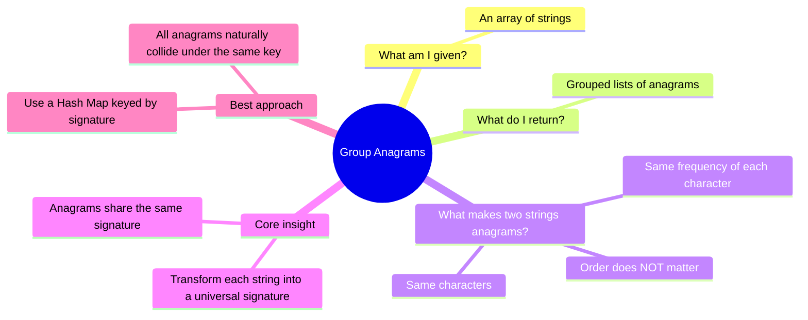

---

## 🧭 The Two Phases of Solving

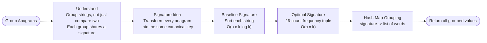

---

## 🔑 Core Insight Before Any Code

```
"eat"  →  signature  →  "aet"
"tea"  →  signature  →  "aet"
"ate"  →  signature  →  "aet"

All three map to the same key → grouped together ✅

"tan"  →  signature  →  "ant"
"nat"  →  signature  →  "ant"

Both map to the same key → grouped together ✅

"bat"  →  signature  →  "abt"

Unique key → its own group ✅
```

The key architectural question: **"How do I transform every anagram into the exact same universal signature?"**

```
[Raw Strings] ──> [Signature Generator] ──> [Hash Map (Grouping)]
      │                      │                          │
"eat","tea","ate"  ──>     "aet"        ──>  { "aet": ["eat","tea","ate"] }
```

---

## 📊 Strategic Decision Flow & Stress-Testing

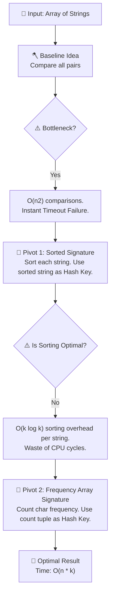

---

## 📊 Solution Progression Overview

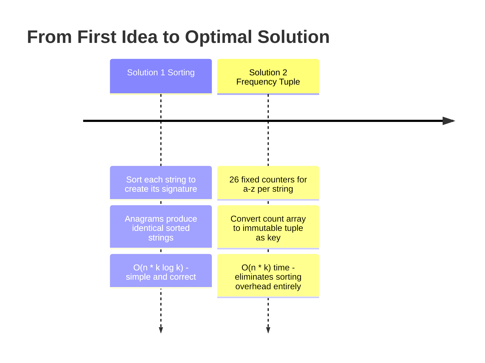

---
---

# ✏️ Solution 1 — Sorting as a Signature

## Thinking From This Perspective

**My starting thought:** *"If I sort 'eat', 'tea', and 'ate' alphabetically, they all become 'aet'. Therefore, if I loop through the array, sort each string, and use the sorted version as a dictionary key, all anagrams will automatically group together under that key."*

```
"eat" → sorted → "aet"
"tea" → sorted → "aet"
"ate" → sorted → "aet"

All three share the key "aet" → grouped ✅
```

---

## Visual — Sorting Normalizes All Anagrams

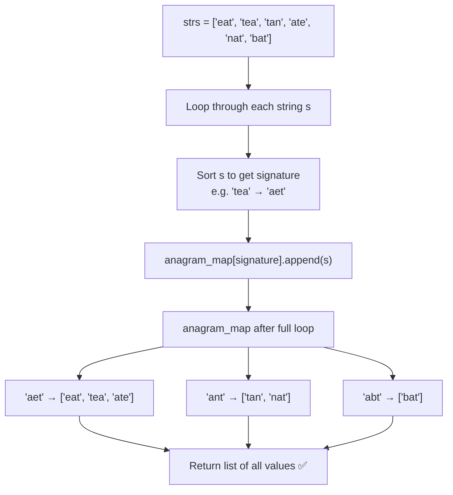

---

## Step-by-Step Walkthrough

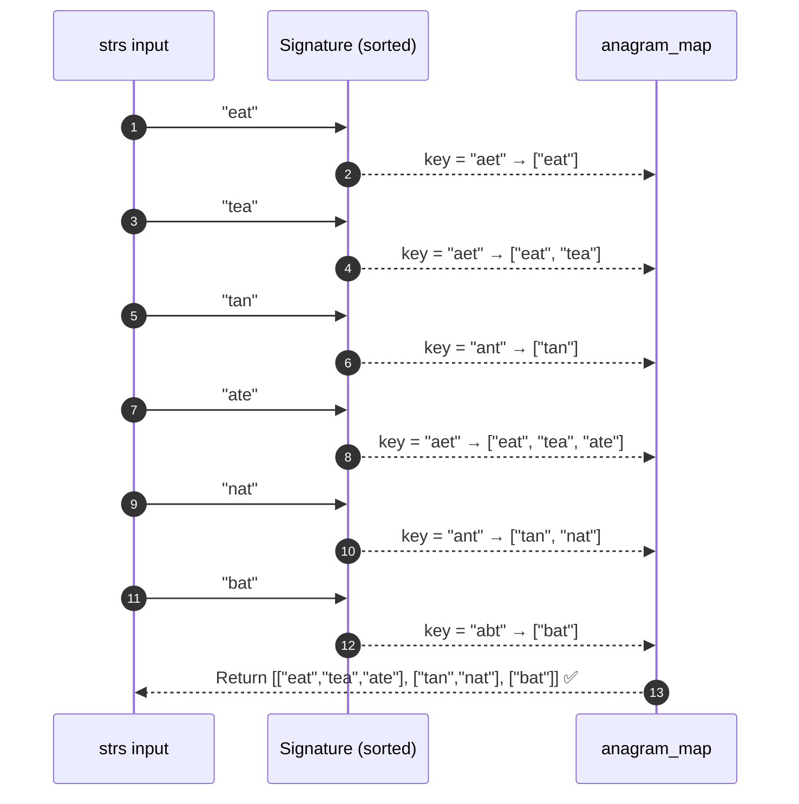

---

## Complexity

```
Time:  O(n * k log k)  — sorting each string of length k, for n strings
Space: O(n * k)        — storing all strings in the hash map
```

---

## ✅ Full LeetCode Solution — Sorting

```python
from collections import defaultdict
from typing import List

class Solution:
    def groupAnagrams(self, strs: List[str]) -> List[List[str]]:
        anagram_map = defaultdict(list)

        for s in strs:
            # Sort the string to create the universal signature
            # e.g., "tea" -> ['a', 'e', 't'] -> "aet"
            signature = "".join(sorted(s))
            anagram_map[signature].append(s)

        return list(anagram_map.values())
```

---

## Why I Move to the Next Solution

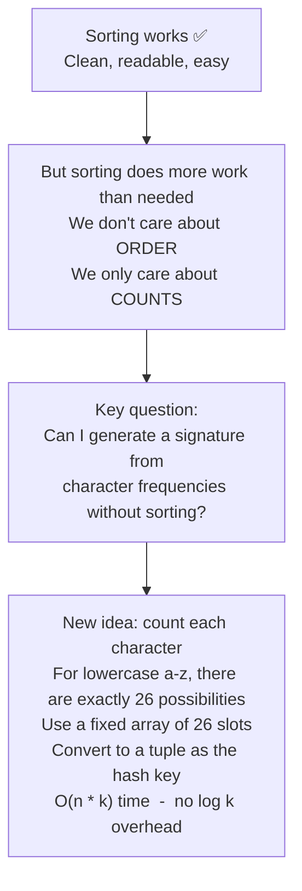

---
---

# ✏️ Solution 2 — Character Frequency Tuple (Optimal)

## Thinking From This Perspective

**My new thought:** *"I don't need to sort strings. Anagrams are defined by character counts. Since the problem guarantees lowercase English letters, I can create a fixed array of 26 zeros. For each string, I'll count the characters, convert that 26-element array into a tuple (since lists cannot be dictionary keys in Python), and use that as my O(1) hashing signature."*

Formula to map a letter to its index:
```
index = ord(char) - ord('a')

'a' → 0
'b' → 1
...
'z' → 25
```

---

## Visual — Mapping Characters to a 26-Bucket Array

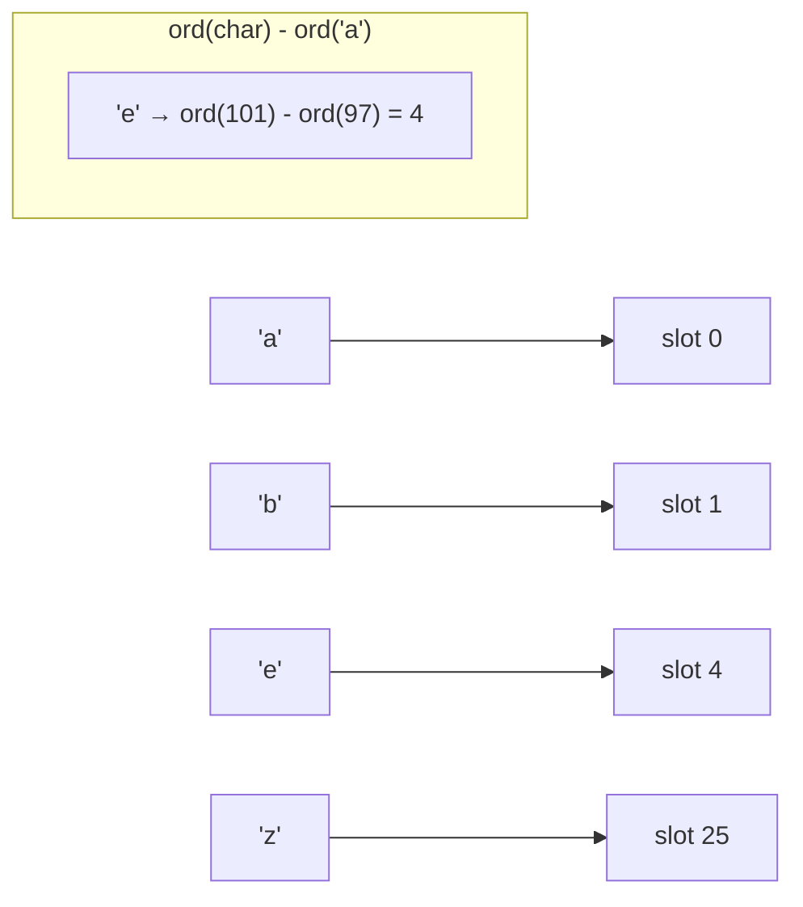

---

## Building the Frequency Tuple Signature

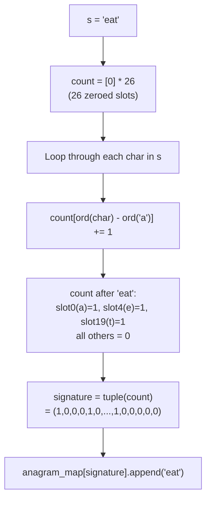

---

## Walkthrough — "eat", "tea", "ate" All Share the Same Tuple

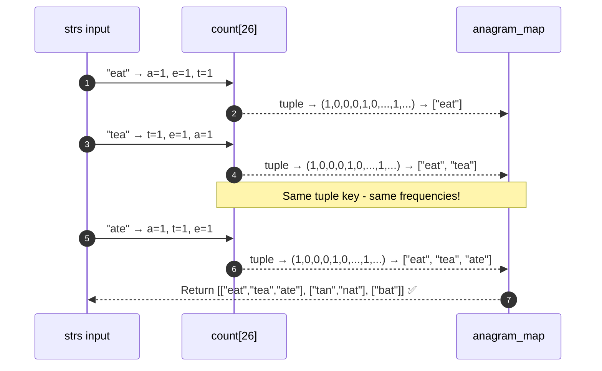

---

## Complexity

```
Time:  O(n * k)   — scan each character of each string once; no sorting
Space: O(n * k)   — storing all strings in the hash map
```

---

## ✅ Full LeetCode Solution — Frequency Tuple

```python
from collections import defaultdict
from typing import List

class Solution:
    def groupAnagrams(self, strs: List[str]) -> List[List[str]]:
        anagram_map = defaultdict(list)

        for s in strs:
            # Initialize an empty 26-bucket array for character frequencies
            count = [0] * 26

            for char in s:
                # Increment the specific character's index (a=0, b=1... z=25)
                count[ord(char) - ord('a')] += 1

            # Convert the list to an immutable tuple to use as a dictionary key
            signature = tuple(count)
            anagram_map[signature].append(s)

        return list(anagram_map.values())
```

---

## Full Comparison of Both Solutions

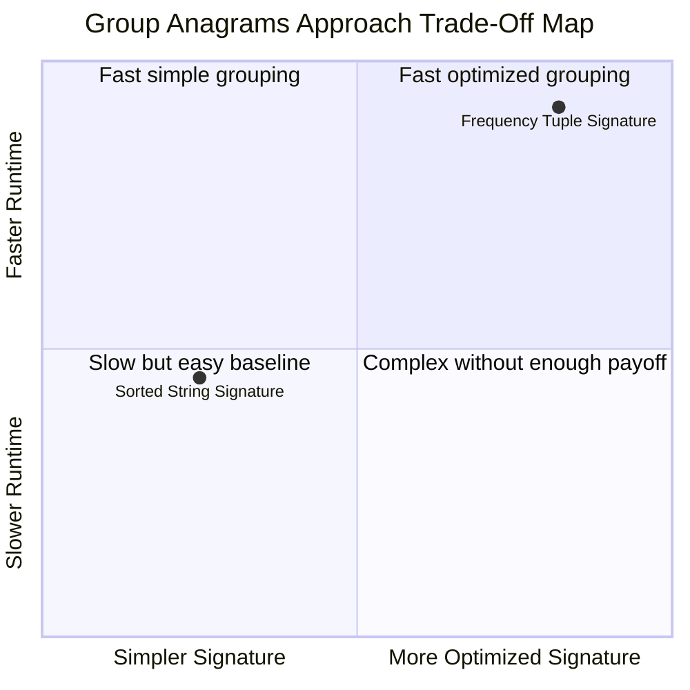

---

## Approach Trade-Off Map

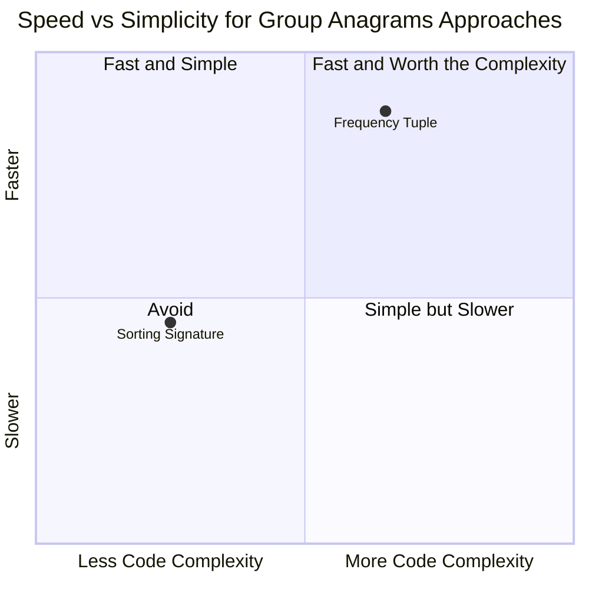

---

## 🔁 The Reusable Pattern

```python
# Signature-Based Grouping Pattern
from collections import defaultdict

groups = defaultdict(list)
for item in input_list:
    signature = generate_signature(item)   # transform into a canonical key
    groups[signature].append(item)         # collide all equivalents under same key
return list(groups.values())
```

Apply this pattern to: **anagram grouping, classifying strings by shape, grouping words by character distribution, categorizing objects by a canonical form.**

---

## ✅ Final Takeaways

```
1. Never compare every string to every other string — that is an O(n²) trap
2. Instead, assign each string a universal "signature" so anagrams naturally collide in a Hash Map
3. Sorting is a valid signature (O(k log k)) but carries unnecessary overhead
4. Frequency tuple is the optimal signature (O(k)) — pure character counting, no sorting
5. Use defaultdict(list) to avoid KeyError when appending to a new key
6. Tuples are immutable → hashable → valid dictionary keys; lists are not
7. Progression: O(n²) brute force → O(n * k log k) sorting → O(n * k) frequency tuple
```

> 💡 When asked to **group or categorize** items that are "equivalent" by some rule — find a way to **transform each item into a canonical key** and let the Hash Map do the grouping automatically.
