# 🔢 LeetCode #347 — Top K Frequent Elements

> **[Open on LeetCode →](https://leetcode.com/problems/top-k-frequent-elements/)**
> **Difficulty:** Medium | **Topic:** Array, Hash Map, Bucket Sort

---

## 📋 Problem Statement

Given an integer array `nums` and an integer `k`, return the `k` most frequent elements. You may return the answer in **any order**.

**Constraints:**
```
1 <= nums.length <= 10^5
-10^4 <= nums[i] <= 10^4
k is in the range [1, the number of unique elements in the array]
It is guaranteed that the answer is unique
```

**⚠️ Hidden Constraint:** Your algorithm's time complexity must be **better than** `O(n log n)`, where `n` is the array's size.

---

## 📌 Examples

```
Input:  nums = [1,1,1,2,2,3],  k = 2
Output: [1, 2]
Reason: 1 appears 3 times, 2 appears 2 times — the top 2 most frequent

Input:  nums = [1],  k = 1
Output: [1]
Reason: Only one element, it is trivially the most frequent
```

---

## 🗺️ Understanding the Problem First

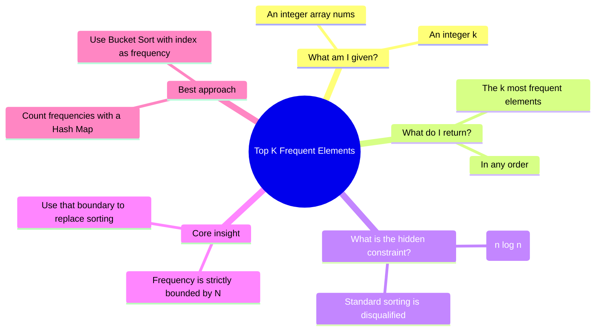

---

## 🧭 The Two Phases of Solving

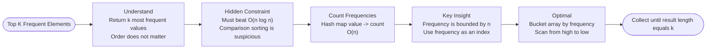

---

## 🔑 Core Insight Before Any Code

```
nums = [1, 1, 1, 2, 2, 3]

Step 1 — Count frequencies:
{ 1: 3,  2: 2,  3: 1 }

Step 2 — Key observation:
Maximum possible frequency = len(nums) = 6
Minimum possible frequency = 1

Therefore frequencies are BOUNDED between 1 and N.
We can use frequency as an array index — no sorting needed!

Step 3 — Bucket array (index = frequency):
Index 0: []        ← unused
Index 1: [3]       ← 3 appears 1 time
Index 2: [2]       ← 2 appears 2 times
Index 3: [1]       ← 1 appears 3 times
...
Index 6: []

Read right-to-left → [1, 2] ✅  (top 2 most frequent)
```

The key architectural insight: **Frequency ≤ N, so map frequency → array index and replace sorting with a spatial structure.**

```
[Raw Array] ──> [Frequency Map] ──> [Index-as-Frequency Bucket Array]
     │                 │                            │
[1, 1, 2]         {1: 2, 2: 1}         Index 1: [2], Index 2: [1]
```

---

## 📊 Strategic Decision Flow & Stress-Testing

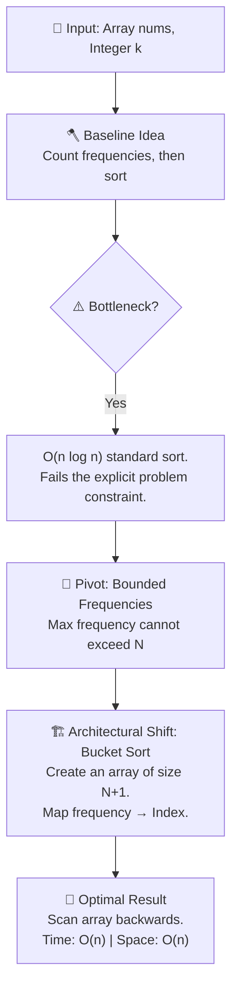

---

## 📊 Solution Progression Overview

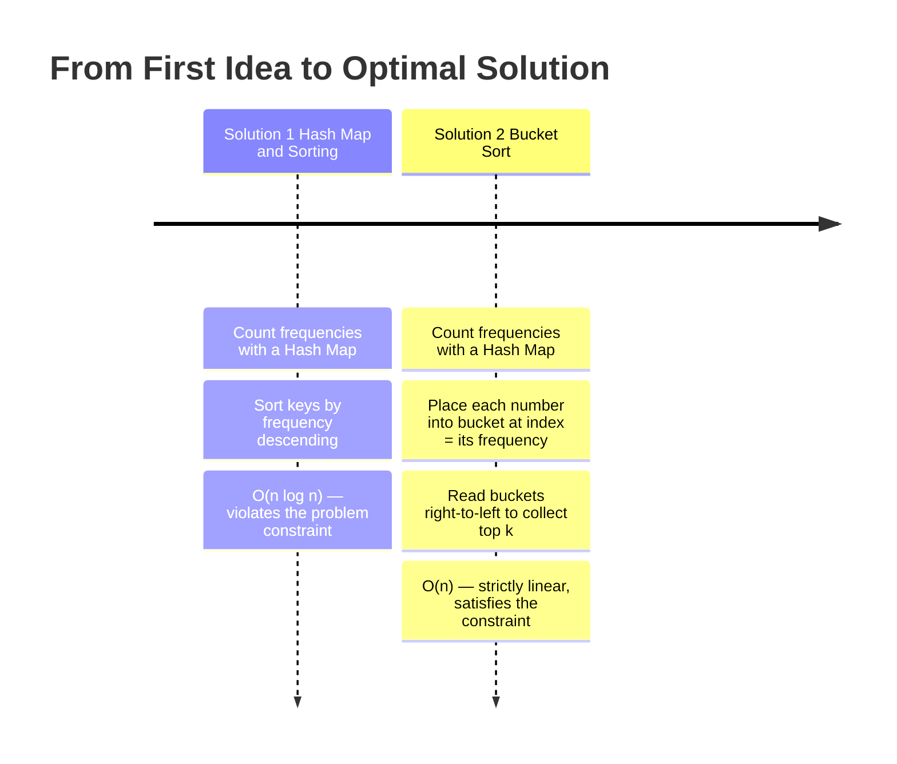

---
---

# ✏️ Solution 1 — Hash Map + Sorting

## Thinking From This Perspective

**My starting thought:** *"I'll count how many times each number appears using a Hash Map. Then I'll take the keys of the Hash Map, sort them based on their corresponding values (frequencies) in descending order, and slice off the top k."*

```
nums = [1, 1, 1, 2, 2, 3],  k = 2

Step 1 — Build frequency map:
count = { 1: 3,  2: 2,  3: 1 }

Step 2 — Sort keys by frequency descending:
sorted_keys = [1, 2, 3]

Step 3 — Slice top k:
sorted_keys[:2] = [1, 2] ✅
```

---

## Visual — Counting Then Sorting

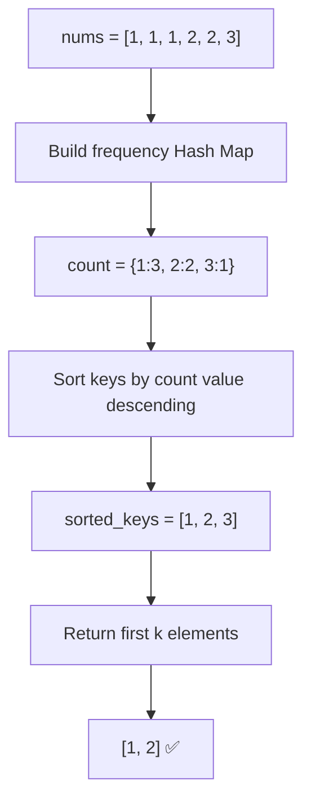

---

## Step-by-Step Walkthrough

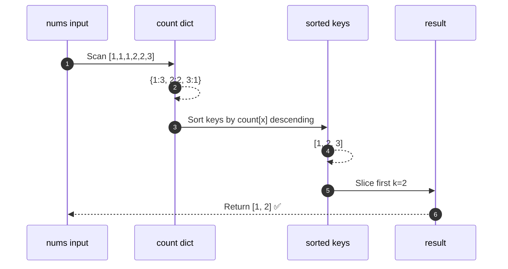

---

## Complexity

```
Time:  O(n log n)  — sorting the unique keys by frequency
Space: O(n)        — storing the frequency hash map
```

---

## ✅ Full LeetCode Solution — Sorting

```python
from typing import List

class Solution:
    def topKFrequent(self, nums: List[int], k: int) -> List[int]:
        count = {}
        for num in nums:
            count[num] = count.get(num, 0) + 1

        # Sort keys based on values in descending order
        sorted_keys = sorted(count.keys(), key=lambda x: count[x], reverse=True)

        return sorted_keys[:k]
```

---

## Why I Move to the Next Solution

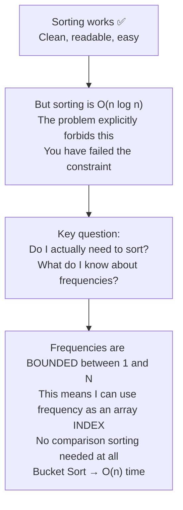

---
---

# ✏️ Solution 2 — Index-as-Frequency Bucket Sort (Optimal)

## Thinking From This Perspective

**My new thought:** *"I know the frequency of any number will never be less than 1, and it will never be greater than N (the length of the array). Instead of sorting, I will create an array of empty lists called buckets of size N+1. I will use the index of the bucket to represent the frequency. If the number 7 appears 3 times, I will append 7 to buckets[3]. Then, I just read the bucket array backwards from right to left to get the most frequent items first."*

```
Frequency is BOUNDED:  1  ≤  frequency  ≤  N

Therefore: use frequency as an array index.
This replaces a temporal sort with a spatial placement.
```

---

## Visual — Building the Bucket Array

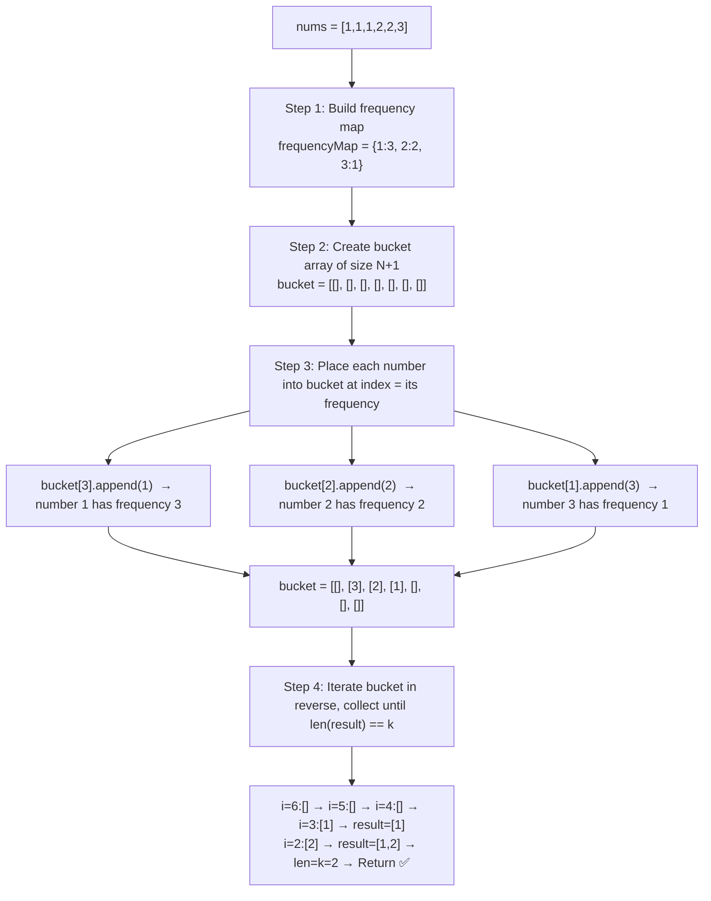

---

## The Index-as-Frequency Mental Model

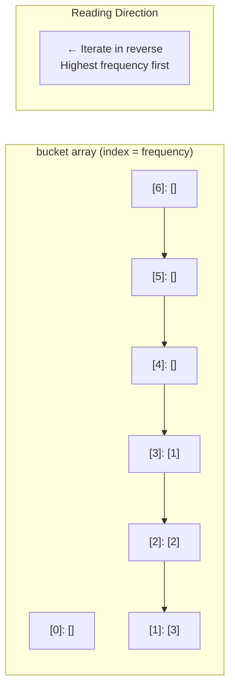

---

## Step-by-Step Walkthrough

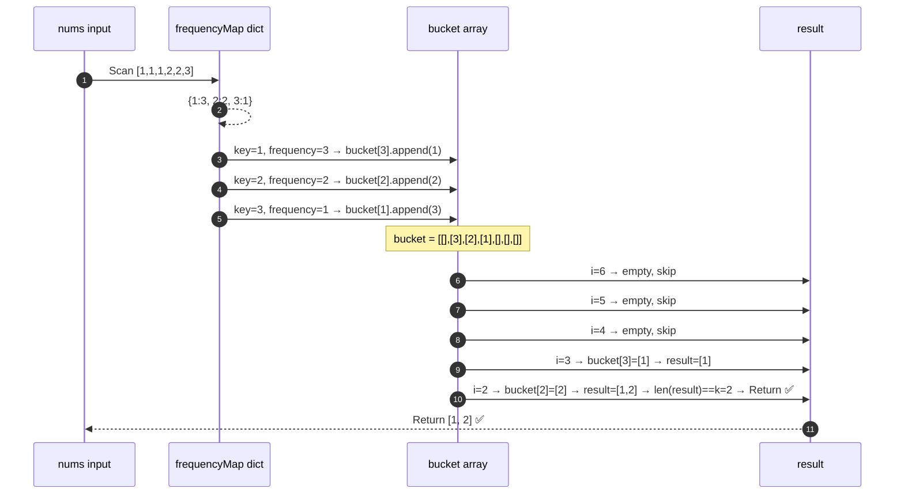

---

## Complexity

```
Time:  O(n)  — filling frequencyMap O(n) + populating bucket O(n) + iterating bucket O(n)
Space: O(n)  — O(n) for the frequencyMap + O(n) for the bucket array
```

---

## ✅ Full LeetCode Solution — Bucket Sort

```python
from typing import List

class Solution:
    def topKFrequent(self, nums: List[int], k: int) -> List[int]:
        # Initialize bucket as a list of empty lists
        bucket = [[] for _ in range(len(nums) + 1)]
        frequencyMap = {}

        # Fill frequencyMap
        for n in nums:
            if n not in frequencyMap:
                frequencyMap[n] = 1
            else:
                frequencyMap[n] += 1

        # Fill bucket
        for key, frequency in frequencyMap.items():
            bucket[frequency].append(key)

        result = []

        # Iterate bucket in reverse to get top k frequent elements
        for i in reversed(range(len(bucket))):
            if bucket[i]:
                for value in bucket[i]:
                    if len(result) < k:
                        result.append(value)
                    else:
                        return result
        return result
```

---

## Full Comparison of Both Solutions

```mermaid
quadrantChart
    title Top K Frequent Elements Approach Trade-Off Map
    x-axis Simpler Method --> Uses Frequency Structure
    y-axis Slower Runtime --> Faster Runtime
    quadrant-1 Fast and constraint-aware
    quadrant-2 Fast and simple
    quadrant-3 Violates hidden constraint
    quadrant-4 Structural but not fast enough
    Hash Map + Sorting O(n log n): [0.25, 0.42]
    Index-as-Frequency Bucket Sort O(n): [0.88, 0.94]
```

---

## Approach Trade-Off Map

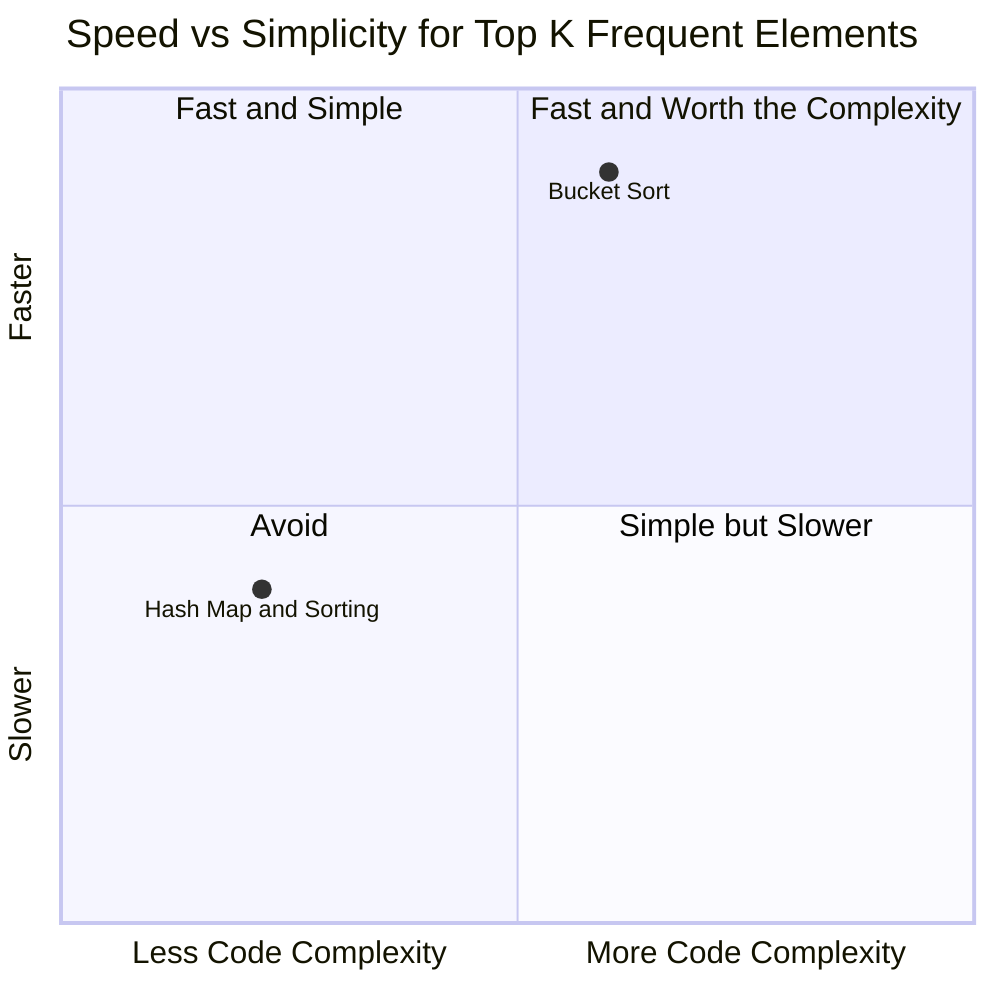

---

## 🔁 The Reusable Pattern

```python
# Index-as-Frequency Bucket Sort Pattern
frequencyMap = {}
for item in input_list:
    if item not in frequencyMap:
        frequencyMap[item] = 1
    else:
        frequencyMap[item] += 1                    # build frequency map

bucket = [[] for _ in range(len(input_list) + 1)] # bucket array; index = frequency
for key, frequency in frequencyMap.items():
    bucket[frequency].append(key)                  # place item in its frequency bucket

result = []
for i in reversed(range(len(bucket))):             # iterate in reverse (highest freq first)
    if bucket[i]:
        for value in bucket[i]:
            if len(result) < k:
                result.append(value)
            else:
                return result
return result
```

Apply this pattern to: **top k frequent words, most common elements, frequency-ranked retrieval — any problem where you need the highest-frequency items and the constraint bans O(n log n).**

---

## ✅ Final Takeaways

```
1. When you see "Top K" — your first instinct is count + sort
2. When you see "better than O(n log n)" — standard sorting is immediately disqualified
3. The key insight: frequency is strictly bounded between 1 and N
4. Bounded values can be mapped to array indices — this is Bucket Sort
5. Bucket Sort replaces a temporal operation (sorting) with a spatial structure (array placement)
6. Iterating the bucket array in reverse gives elements in descending frequency order
7. The moment len(result) == k, return immediately — no need to scan the rest
8. Progression: O(n log n) sort → O(n) bucket sort by exploiting mathematical boundaries
```

> 💡 When you know the **boundaries of a value**, you can often replace sorting with **direct index mapping** — turning an O(n log n) problem into an O(n) one.
