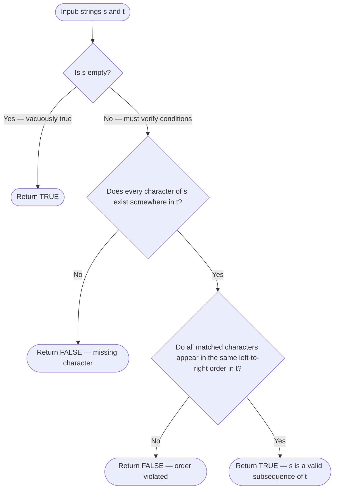
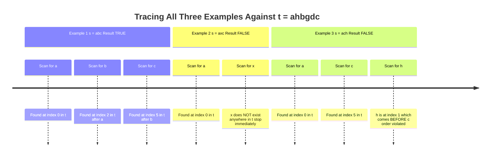
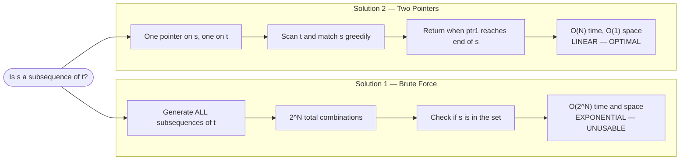
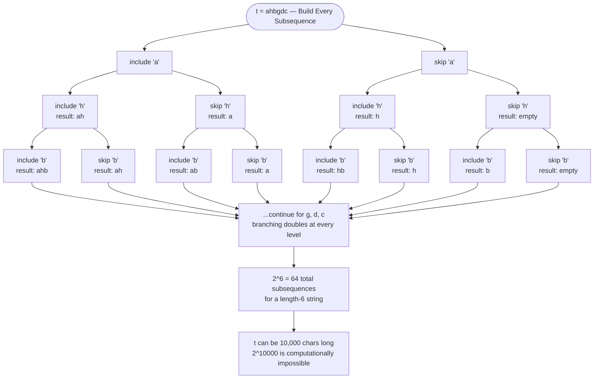
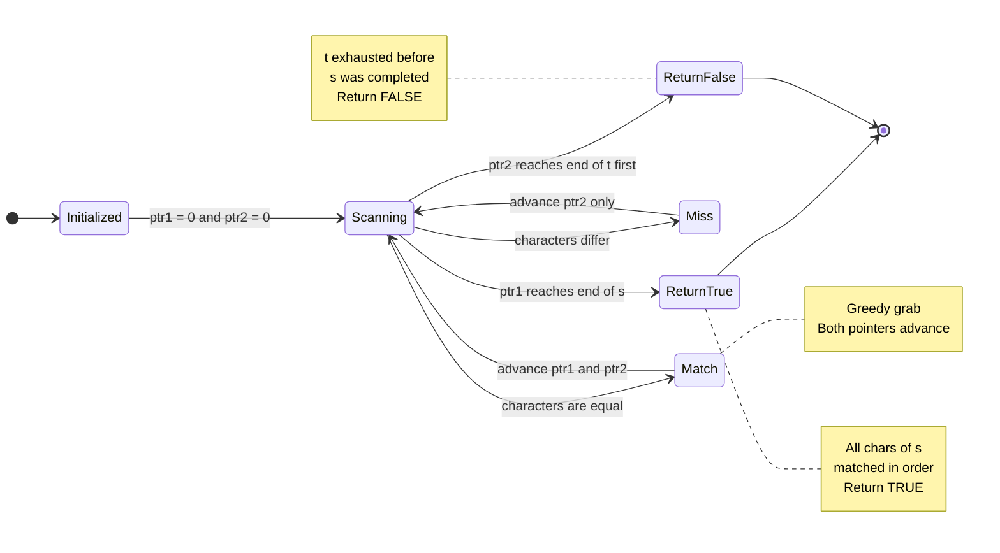
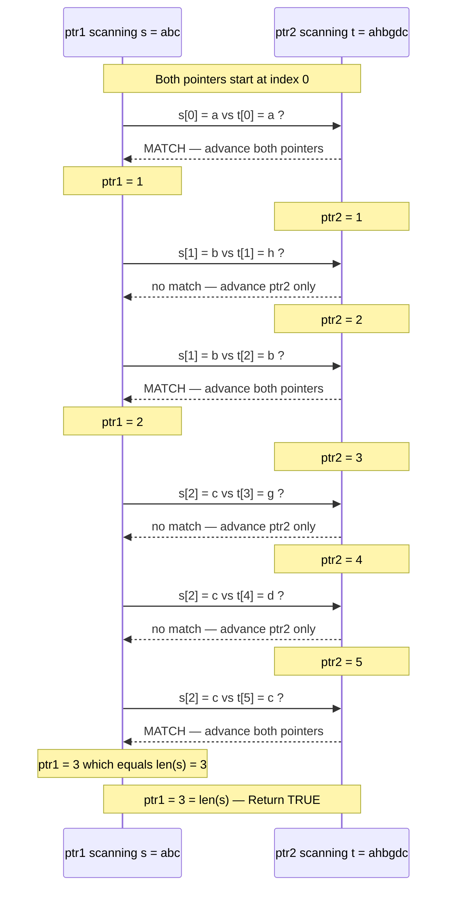
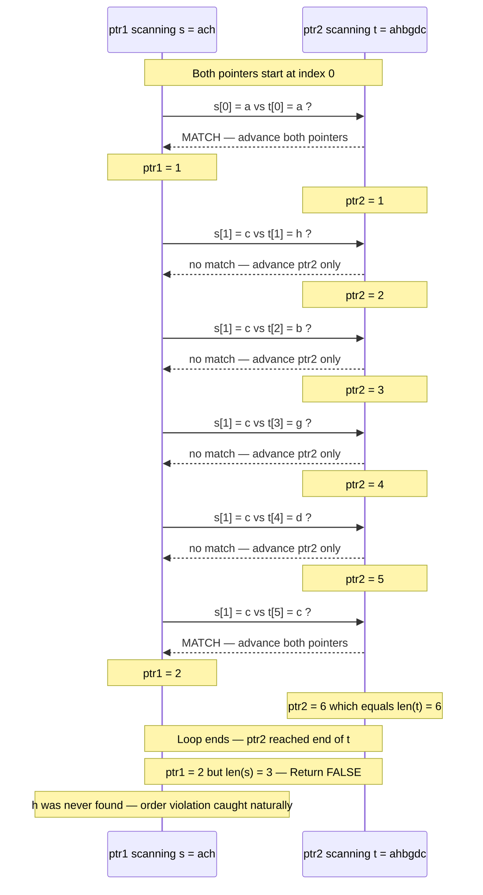
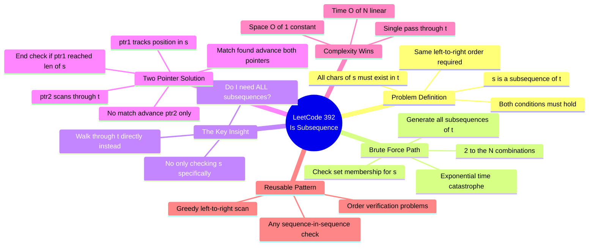
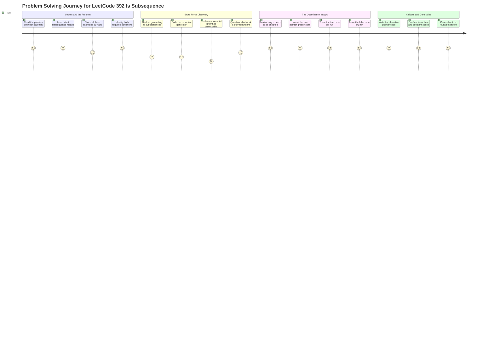

# 🔢 LeetCode #392 — Is Subsequence

> **[Open on LeetCode →](https://leetcode.com/problems/is-subsequence/)**
> **Difficulty:** Easy | **Topic:** Two Pointers, String, Dynamic Programming

---

## 📋 Problem Statement

Given two strings `s` and `t`, return `true` if `s` is a **subsequence** of `t`, or `false` otherwise.

A **subsequence** of a string is a new string that is formed from the original string by deleting some (can be none) of the characters without disturbing the relative positions of the remaining characters.

**Constraints:**
```
0 <= s.length <= 100
0 <= t.length <= 10^4
s and t consist only of lowercase English letters
```

### Diagram 1 — What Makes a Valid Subsequence



---

## 📌 Examples

```
s = "abc",  t = "ahbgdc"  →  true
s = "axc",  t = "ahbgdc"  →  false
s = "ach",  t = "ahbgdc"  →  false
```

### Diagram 2 — Three Examples: Decision Paths



---

## 🗺️ Understanding the Problem First

Before writing a single line of code, you need to deeply understand what a **subsequence** actually is.

**Two conditions must BOTH be true for `s` to be a subsequence of `t`:**

```
Condition 1: Every character in s must exist somewhere in t.
Condition 2: The characters must appear in the same relative ORDER in t.
```

**Let's validate examples manually:**

```
s = "abc",  t = "ahbgdc"

a → found at index 0 ✅
b → found at index 2 (after a) ✅
c → found at index 5 (after b) ✅
→ true


s = "axc",  t = "ahbgdc"

a → found ✅
x → NOT found anywhere in t ❌
→ false immediately


s = "ach",  t = "ahbgdc"

a → found at index 0 ✅
c → found at index 5 ✅
h → found at index 1... but h is BEFORE c ❌
→ false (order is violated)
```

> 💡 **The order check is what makes this tricky.** All characters can be present but the answer is still false if they don't follow the same left-to-right sequence.

---

## 🔑 Core Insight Before Any Code

```
We are NOT asking: "Does t contain the characters of s?"
We ARE asking:    "Can we walk through t left-to-right and match
                   every character of s in order?"
```

This distinction is everything. It tells you the brute force approach and it tells you exactly why the efficient approach works.

---

## 📊 Solution Progression Overview

```
Solution 1 — Brute Force
  Generate every possible subsequence of t.
  Check if s is in that collection.
  Exponential time. Never do this in an interview.

Solution 2 — Two Pointers (Efficient)
  Walk t with one pointer, walk s with another.
  Match characters as you find them.
  O(n) time. This is the answer.
```

### Diagram 3 — Solution Approaches Compared



---

## ✏️ Solution 1 — Brute Force

### The Problem-Solver's Thinking

**Starting thought:** *"The definition says s is a subsequence of t if s can be formed from t by deleting some characters. So what if I just generate every possible subsequence of t and check if s is among them?"*

This is a completely logical first instinct. You take what the problem says literally and implement it directly.

**How you generate all subsequences of `t = "ahbgdc"`:**

For each character in t, you make a choice: include it or skip it. This produces 2^N combinations.

```
Starting with 'a':
  a
  ah
  ahb
  ahbg
  ahbgd
  ahbgdc
  ← then skip 'h':
  ab
  abg
  abgd
  abgdc
  abc       ← found "abc" here ✅
  ← then skip 'h' and 'b':
  ag
  agd
  agdc
  ac
  ← and so on...
```

You can see the problem immediately: with just 6 characters you already have dozens of combinations. With `t` up to 10,000 characters long this becomes completely unworkable.

### Diagram 4 — Brute Force: The Exponential Choice Tree



### The Code

```python
class Solution:
    def isSubsequence(self, s: str, t: str) -> bool:
        def generate_subsequences(string):
            if not string:
                return {""}
            rest = generate_subsequences(string[1:])
            return rest | {string[0] + sub for sub in rest}

        return s in generate_subsequences(t)
```

This recursively builds every possible subsequence of `t` by choosing to include or exclude each character, then checks whether `s` is in that set.

### Why the Brute Force Fails

```
For a string of length N, there are 2^N possible subsequences.
t can be up to 10,000 characters long.
2^10000 is a number that cannot be computed.

Time Complexity:  O(2^N)  — exponential, catastrophic
Space Complexity: O(2^N)  — storing all subsequences
```

The brute force tells you something important though: **you are generating and checking combinations that you clearly do not need.** You are doing a massive amount of redundant work. This is the signal to look for a smarter approach.

### The Key Question to Ask Yourself

> *"Do I actually need all possible subsequences of t? Or is there a way to just check if s specifically is a subsequence, without generating everything else?"*

This question leads directly to the efficient solution.

---

## ✏️ Solution 2 — Two Pointers (Efficient)

### The Problem-Solver's Thinking

**New thought:** *"I don't need all subsequences. I only need to check one specific string: s. What if I just try to match s against t character by character, moving left to right?"*

Here is the realization: if I put one pointer on s and one pointer on t, I can scan t and greedily grab characters that match s. The moment I find a match, I advance the s pointer. If I reach the end of s, I've confirmed every character was found in order.

**The two-pointer rules:**
```
Rule 1: If s[ptr1] == t[ptr2]  →  match found! Advance BOTH pointers.
Rule 2: If s[ptr1] != t[ptr2]  →  no match. Advance ONLY ptr2 (keep scanning t).
```

### Diagram 5 — Two Pointer Algorithm Flowchart



### Dry Run — `s = "abc"`, `t = "ahbgdc"`

```
ptr1 → s:  a  b  c
ptr2 → t:  a  h  b  g  d  c

Step 1: s[0]='a' vs t[0]='a'  →  MATCH  →  ptr1=1, ptr2=1
Step 2: s[1]='b' vs t[1]='h'  →  no match  →  ptr2=2
Step 3: s[1]='b' vs t[2]='b'  →  MATCH  →  ptr1=2, ptr2=3
Step 4: s[2]='c' vs t[3]='g'  →  no match  →  ptr2=4
Step 5: s[2]='c' vs t[4]='d'  →  no match  →  ptr2=5
Step 6: s[2]='c' vs t[5]='c'  →  MATCH  →  ptr1=3, ptr2=6

ptr1 (3) == len(s) (3)  →  return True ✅
```

### Diagram 6 — Dry Run Visual: s="abc" in t="ahbgdc" (True Case)



### Dry Run — `s = "ach"`, `t = "ahbgdc"` (Order Violation)

```
ptr1 → s:  a  c  h
ptr2 → t:  a  h  b  g  d  c

Step 1: s[0]='a' vs t[0]='a'  →  MATCH  →  ptr1=1, ptr2=1
Step 2: s[1]='c' vs t[1]='h'  →  no match  →  ptr2=2
Step 3: s[1]='c' vs t[2]='b'  →  no match  →  ptr2=3
Step 4: s[1]='c' vs t[3]='g'  →  no match  →  ptr2=4
Step 5: s[1]='c' vs t[4]='d'  →  no match  →  ptr2=5
Step 6: s[1]='c' vs t[5]='c'  →  MATCH  →  ptr1=2, ptr2=6

Loop ends: ptr2 (6) == len(t) (6), while condition fails.
ptr1 (2) != len(s) (3)  →  return False ❌
```

The 'h' in s was never matched because by the time 'c' was found, there were no more characters in t left to find 'h'. **The order violation is caught naturally** — you simply run out of t before you finish matching s.

### Diagram 7 — Dry Run Visual: s="ach" in t="ahbgdc" (False Case — Order Violation)



### The Code

```python
class Solution:
    def isSubsequence(self, s: str, t: str) -> bool:
        itr1, itr2 = 0, 0

        while itr1 < len(s) and itr2 < len(t):
            if s[itr1] == t[itr2]:
                itr1 += 1   # match found: advance both
            itr2 += 1       # always advance through t

        return itr1 == len(s)
```

### Why `return itr1 == len(s)` Works

At the end of the loop, one of two things happened:

```
Case 1: itr1 reached len(s)
  → We matched every character in s
  → itr1 == len(s) is True  →  return True

Case 2: itr2 reached len(t) before itr1 reached len(s)
  → We exhausted t without matching all of s
  → itr1 < len(s)  →  return False
```

A single comparison at the end handles both cases cleanly.

### Complexity

```
Time Complexity:  O(N)  where N = len(t)
  In the worst case we scan all of t once. That's the maximum work we do.

Space Complexity: O(1)
  Two integer pointers. No extra data structures. No allocations.
```

### Diagram 8 — Complexity Comparison: Brute Force vs Two Pointers

```mermaid
quadrantChart
    title Time vs Space Complexity — Brute Force vs Two Pointers
    x-axis Efficient Time --> Slow Time
    y-axis Efficient Space --> Wasteful Space
    quadrant-1 Slow and memory heavy — Avoid
    quadrant-2 Memory heavy but fast
    quadrant-3 Ideal — fast and lean
    quadrant-4 Slow but memory lean
    Two Pointers O(N) time O(1) space: [0.05, 0.05]
    Brute Force O(2^N) time O(2^N) space: [0.95, 0.95]
```

---

## 🔁 The Reusable Pattern

```python
# Two-Pointer String Matching Pattern
# Use when: checking if one sequence can be found inside another in order

ptr1, ptr2 = 0, 0

while ptr1 < len(shorter) and ptr2 < len(longer):
    if shorter[ptr1] == longer[ptr2]:
        ptr1 += 1      # advance the "target" pointer only on a match
    ptr2 += 1          # always advance through the "source"

return ptr1 == len(shorter)
```

Apply this pattern when: matching characters from one string inside another, verifying relative ordering, or checking if a pattern survives deletions from a larger string.

---

## 🧠 The Mental Shift: Brute Force → Efficient

```
Brute Force mindset:
  "Generate all possible versions, check if mine is in there."
  Problem: Creates exponential work for something that doesn't need it.

Efficient mindset:
  "I only care about one specific check. Can I walk through
   the data once and answer it directly?"
  Solution: Two pointers, one pass, done.

The shift happens when you ask:
  "What work am I doing that I don't actually need?"
```

### Diagram 9 — Mental Shift: From Brute Force to Efficient Thinking



---

## 🗺️ Problem Solving Journey

### Diagram 10 — Full Problem Solving Journey



---

## ✅ Final Takeaways

```
1. Subsequence = all characters present AND in the same relative order.
2. The brute force (generate all subsequences) is exponential — never use it.
3. The efficient solution uses two pointers: one on s, one on t.
4. On a match: advance both. On a miss: advance only the t pointer.
5. At the end: if the s pointer reached the end of s, return true.
6. Time: O(N) where N = len(t). Space: O(1).
7. The order violation is caught naturally — you run out of t before finishing s.
```

> 💡 Whenever a problem asks *"can this smaller sequence be found inside a larger one, in order?"* — reach for two pointers, one on each string, and scan greedily.