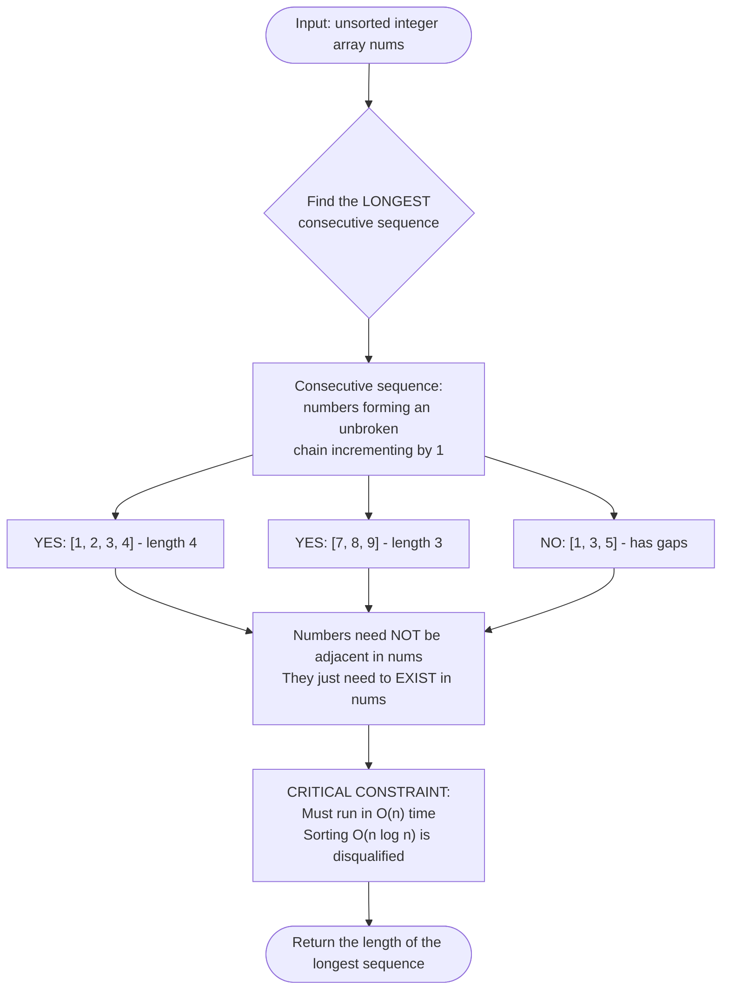
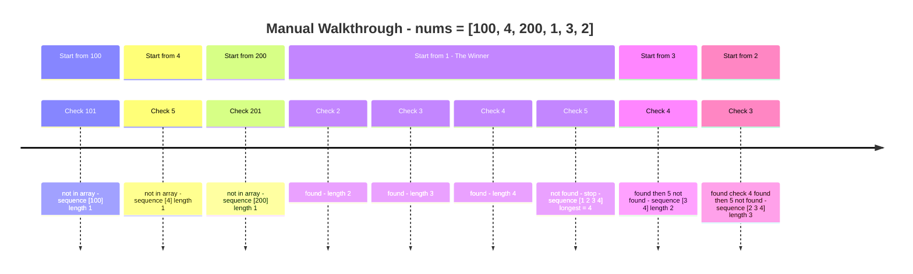
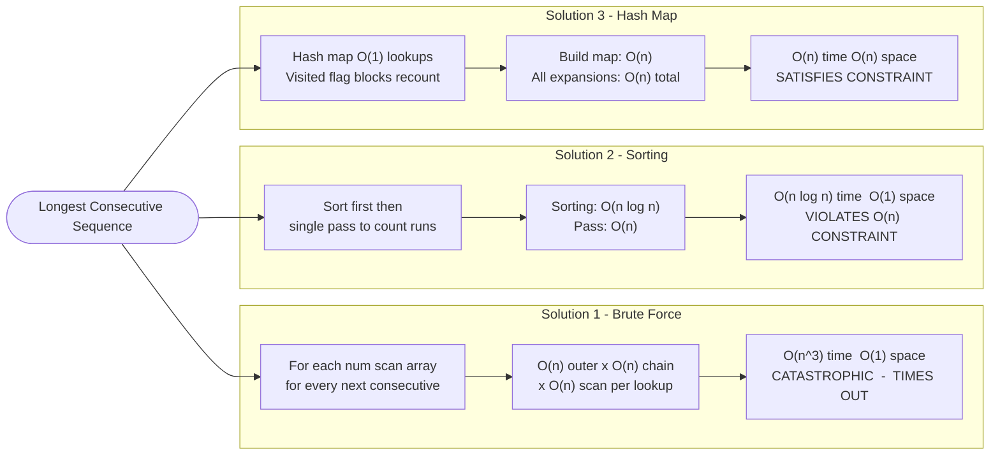
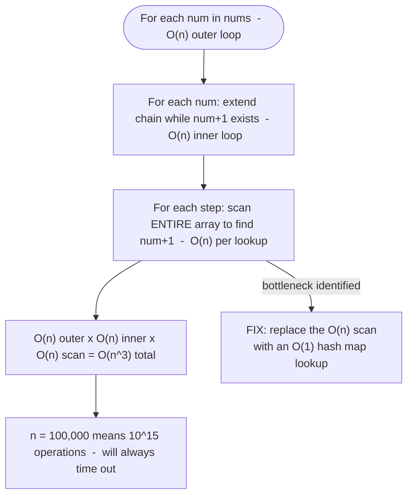
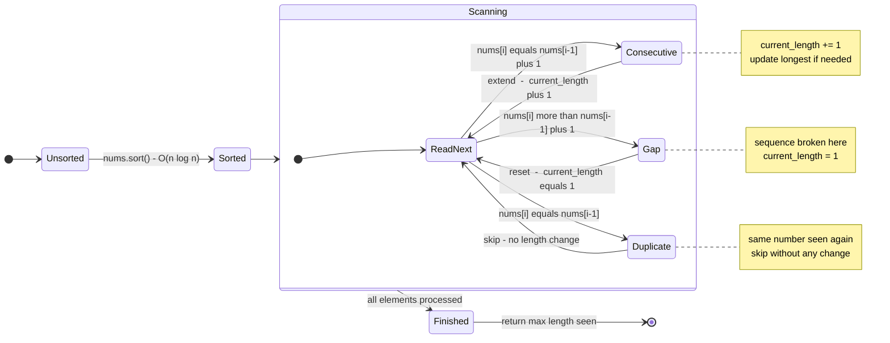
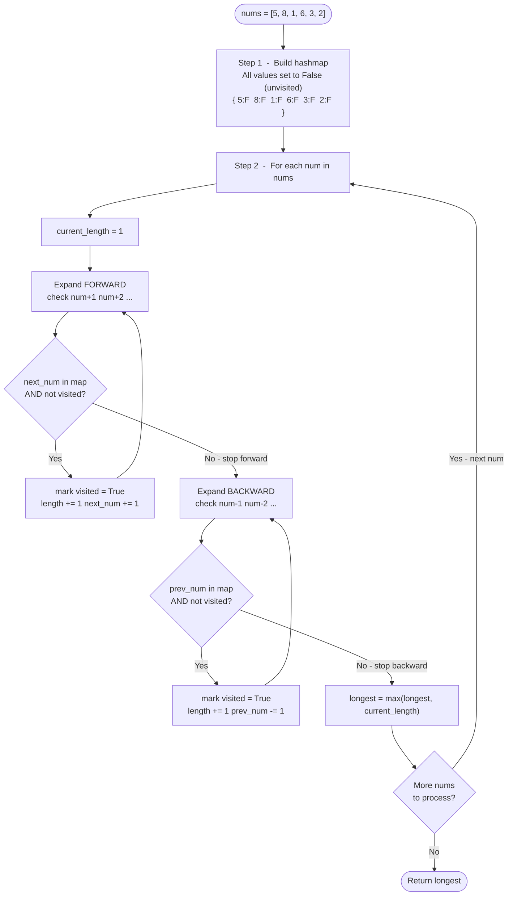
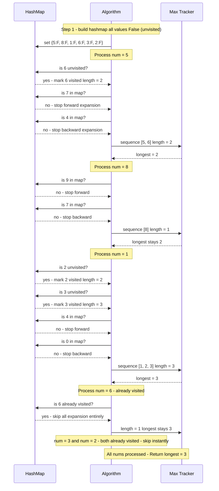
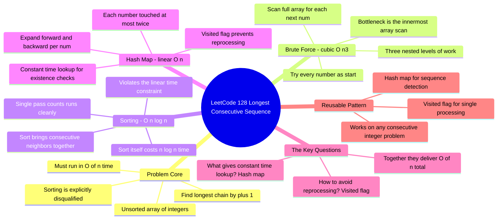
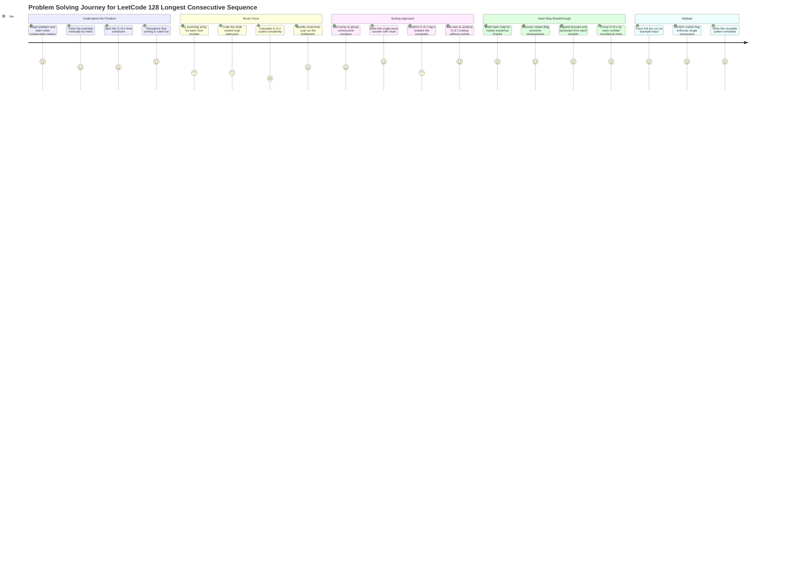

# 🔢 LeetCode #128 — Longest Consecutive Sequence

> **[Open on LeetCode →](https://leetcode.com/problems/longest-consecutive-sequence/)**
> **Difficulty:** Medium | **Topic:** Array, Hash Map, Union Find

---

## 📋 Problem Statement

Given an unsorted array of integers `nums`, return the length of the **longest consecutive elements sequence**.

**You must write an algorithm that runs in O(n) time.**

**Constraints:**
```
0 <= nums.length <= 10^5
-10^9 <= nums[i] <= 10^9
```

### Diagram 1 — Problem Definition: What Is a Consecutive Sequence?



---

## 📌 Examples

```
Input:  nums = [100, 4, 200, 1, 3, 2]
Output: 4
Reason: The longest consecutive sequence is [1, 2, 3, 4]

Input:  nums = [5, 9, 7, 0, 3, 1, 6, 3, 2, 8]
Output: 5
Reason: Two sequences exist: [0,1,2,3] length 4 and [5,6,7,8,9] length 5 → return 5
```

---

## 🗺️ Understanding the Problem First

**What is a "consecutive sequence"?**

```
[1, 2, 3, 4, 5]  →  consecutive, length 5
[7, 8, 9]        →  consecutive, length 3
[1, 3, 5]        →  NOT consecutive (gaps between each number)
```

The numbers don't need to be adjacent in the array. They just need to exist in the array and form an unbroken chain when you count up by 1.

**Walking through `[100, 4, 200, 1, 3, 2]` manually:**

```
Start from 100 → need 101 → not in array → sequence: [100], length 1
Start from 4   → need 5   → not in array → sequence: [4], length 1
Start from 200 → need 201 → not in array → sequence: [200], length 1
Start from 1   → need 2   → found! → need 3 → found! → need 4 → found!
               → need 5   → not found → sequence: [1,2,3,4], length 4  ✅
Start from 3   → need 4   → found → sequence: [3,4], length 2
Start from 2   → need 3   → found → need 4 → found → sequence: [2,3,4], length 3

Longest = 4
```

### Diagram 2 — Manual Walkthrough of [100, 4, 200, 1, 3, 2]



> 💡 **The critical constraint:** The problem explicitly requires **O(n) time**. This immediately rules out sorting (O(n log n)). This is the signal that you need a hash-based approach.

---

## 📊 Solution Progression Overview

```
Solution 1 — Brute Force
  For each number, scan the entire array to build its sequence.
  Time: O(n³). Correct but extremely slow.

Solution 2 — Sorting
  Sort first, then find consecutive runs in one pass.
  Time: O(n log n). Better, but violates the O(n) constraint.

Solution 3 — Hash Map (Efficient)
  Store all numbers in a hash map. For each number, expand
  in both directions only if not already visited.
  Time: O(n). Space: O(n). This is the required answer.
```

### Diagram 3 — Three Solution Approaches Compared



---

## ✏️ Solution 1 — Brute Force

### The Problem-Solver's Thinking

**Starting thought:** *"For each number in the array, I'll try to build the longest consecutive sequence starting from it. To do that, I'll keep looking for the next number (current + 1) by scanning the entire array each time."*

This is the most literal implementation of the problem definition. You take each number, then search for the one after it, then the one after that, until the chain breaks.

**Walking through `[100, 4, 200, 1, 3, 2]`:**

```
Start at 100 → scan all for 101 → not found → length 1
Start at 4   → scan all for 5   → not found → length 1
Start at 200 → scan all for 201 → not found → length 1
Start at 1:
  → scan all for 2 → found at index 5 → length 2
  → scan all for 3 → found at index 4 → length 3
  → scan all for 4 → found at index 1 → length 4
  → scan all for 5 → not found → stop → length 4  ✅
Start at 3:
  → scan all for 4 → found → length 2
  → scan all for 5 → not found → stop → length 2
Start at 2:
  → scan all for 3 → found → length 2
  → scan all for 4 → found → length 3
  → scan all for 5 → not found → stop → length 3

Maximum length = 4
```

The answer is correct, but notice the problem: for every number, every lookup requires iterating the entire array again. That's three nested levels of work.

### The Code

```python
from typing import List

class Solution:
    def longestConsecutive(self, nums: List[int]) -> int:
        longest = 0

        for num in nums:                          # pick each number as a sequence start
            current_num = num
            current_length = 1

            while True:
                next_num = current_num + 1
                found = False
                for n in nums:                    # scan entire array for next_num
                    if n == next_num:
                        found = True
                        break
                if not found:
                    break
                current_num = next_num
                current_length += 1

            longest = max(longest, current_length)

        return longest
```

### Why This Fails

```
Outer loop:        O(n)  — try every starting number
Inner while loop:  O(n)  — how long the sequence extends
Innermost scan:    O(n)  — searching for the next number

Total: O(n³)

For n = 100,000 that is 10^15 operations. This will time out.
```

### The Question to Ask Yourself

> *"The real bottleneck is the innermost scan — I'm searching the entire array just to check if a single number exists. What data structure answers 'does this number exist?' in O(1) instead of O(n)?"*

That question leads directly to the sorting and hash map approaches.

### Diagram 4 — Why Brute Force Fails: Three Nested Loops



---

## ✏️ Solution 2 — Sorting

### The Problem-Solver's Thinking

**New thought:** *"If I sort the array first, all consecutive numbers will already be sitting next to each other. Then I just walk through once and count runs. No inner scan needed."*

```
Unsorted: [54, -1, 0, 6, 7, 5, 9, 8, 94, 95, -1, 1]
Sorted:   [-1, -1, 0, 1, 5, 6, 7, 8, 9, 54, 94, 95]
                  [        ]  [              ]  [  ]
                  length 3      length 5      length 2

Answer: 5
```

Once sorted, a single left-to-right pass is all you need. If the next number is exactly current + 1, extend the sequence. If it's the same (duplicate), skip it. If it's more than 1 away, the sequence broke — start a new one.

### The Code

```python
from typing import List

class Solution:
    def longestConsecutive(self, nums: List[int]) -> int:
        if not nums:
            return 0

        nums.sort()

        longest = 1
        current_length = 1

        for i in range(1, len(nums)):
            if nums[i] == nums[i - 1]:
                continue                          # skip duplicates
            elif nums[i] == nums[i - 1] + 1:
                current_length += 1               # extend the current sequence
                longest = max(longest, current_length)
            else:
                current_length = 1                # sequence broke, reset

        return longest
```

### Why This Is Better But Still Not Enough

```
Time Complexity:  O(n log n)  — the sort dominates everything
Space Complexity: O(1)        — sorting in place

This is a clean, readable solution. In a real interview without the O(n)
constraint, this would be perfectly acceptable. But the problem explicitly
requires O(n), so sorting disqualifies this approach.
```

### The Question to Ask Yourself

> *"Sorting costs O(n log n) because we're rearranging elements to make lookups easier. But what if I could get O(1) lookups without rearranging anything at all? That's exactly what a hash map gives me."*

### Diagram 5 — Sorting Solution: State Machine



---

## ✏️ Solution 3 — Hash Map (Efficient, O(n))

### The Problem-Solver's Thinking

**Final thought:** *"I need O(1) lookup AND I need to avoid re-processing numbers I've already counted. The solution: put everything in a hash map marked as 'unvisited'. Then for each number, expand outward in both directions — forward and backward — marking each number as visited as I go. If a number is already visited, I skip it entirely. This guarantees each number is processed at most once."*

**The two key ideas:**

```
Idea 1: Use a hash map for O(1) existence checks.
        Instead of scanning the array for "does 6 exist?",
        just do hashmap[6] — instant answer.

Idea 2: Mark numbers as visited to prevent re-counting.
        If 1,2,3 was already counted as a sequence of length 3,
        when you later land on 2, you skip it immediately.
        This keeps the total work linear.
```

### Diagram 6 — Hash Map Algorithm Flowchart



### Dry Run — `[5, 8, 1, 6, 3, 2]`

**Step 1: Build the hash map (all values = False = unvisited)**

```
hashmap = { 5: False, 8: False, 1: False, 6: False, 3: False, 2: False }
```

**Step 2: Process each number**

```
─────────────────────────────────────────────────────────────
num = 5, current_length = 1, mark 5 as visited (True)
  Forward:  check 6 → exists, unvisited → length=2, mark 6 visited
            check 7 → not in hashmap → stop
  Backward: check 4 → not in hashmap → stop
  Sequence: [5, 6], length 2
  longest = max(0, 2) = 2

─────────────────────────────────────────────────────────────
num = 8, current_length = 1, mark 8 as visited (True)
  Forward:  check 9 → not in hashmap → stop
  Backward: check 7 → not in hashmap → stop
  Sequence: [8], length 1
  longest = max(2, 1) = 2

─────────────────────────────────────────────────────────────
num = 1, current_length = 1, mark 1 as visited (True)
  Forward:  check 2 → exists, unvisited → length=2, mark 2 visited
            check 3 → exists, unvisited → length=3, mark 3 visited
            check 4 → not in hashmap → stop
  Backward: check 0 → not in hashmap → stop
  Sequence: [1, 2, 3], length 3
  longest = max(2, 3) = 3  ✅

─────────────────────────────────────────────────────────────
num = 6 → already visited (True) → current_length stays 1
  Forward:  check 7 → not in hashmap → stop
  Backward: check 5 → already visited → stop
  longest = max(3, 1) = 3

─────────────────────────────────────────────────────────────
num = 3 → already visited → length 1 → longest stays 3
num = 2 → already visited → length 1 → longest stays 3

Return longest_length = 3 ✅
```

### Diagram 7 — Hash Map Dry Run: [5, 8, 1, 6, 3, 2]



### The Code

```python
from typing import List

class Solution:
    def longestConsecutive(self, nums: List[int]) -> int:
        longest_length = 0
        hashmap = {}

        # Step 1: Populate hashmap — mark every number as unvisited
        for num in nums:
            hashmap[num] = False

        # Step 2: For each number, expand in both directions
        for num in nums:
            current_length = 1

            # Check forward direction (num+1, num+2, ...)
            next_num = num + 1
            while next_num in hashmap and not hashmap[next_num]:
                current_length += 1
                hashmap[next_num] = True          # mark as visited
                next_num += 1

            # Check backward direction (num-1, num-2, ...)
            prev_num = num - 1
            while prev_num in hashmap and not hashmap[prev_num]:
                current_length += 1
                hashmap[prev_num] = True          # mark as visited
                prev_num -= 1

            longest_length = max(longest_length, current_length)

        return longest_length
```

### Why the Visited Flag is Critical

Without marking numbers as visited, processing `[1, 2, 3]` would happen three separate times:

```
Starting from 1: finds 2, 3 → counts sequence of 3
Starting from 2: finds 3    → counts sequence of 2
Starting from 3:             → counts sequence of 1

Total work: 3 + 2 + 1 = 6 operations for 3 numbers → O(n²) creeping back in
```

With the visited flag, once 2 and 3 are marked during the expansion from 1, they are skipped instantly when encountered later. Each number is touched at most twice — once as a starting point, once when consumed as a neighbor. This is what keeps the algorithm O(n).

### Complexity

```
Time Complexity:  O(n)
  — O(n) to build the hashmap
  — O(n) total across all expansions (each number visited at most twice)
  — Total: O(n) + O(n) = O(n)

Space Complexity: O(n)
  — The hashmap stores every element once
```

### Diagram 8 — Complexity Comparison: All Three Solutions


---

## 🧠 The Mental Shift Across All Three Solutions

```
Brute Force:
  "For each number, search the entire array for the next one."
  Problem: O(n) lookup inside O(n²) loops = O(n³). Unsustainable.

Sorting:
  "Rearrange so consecutive numbers sit next to each other."
  Problem: Sorting itself costs O(n log n). Violates the constraint.

Hash Map:
  "Put everything in a map so lookups are O(1). Use a visited
   flag so no number is processed more than once."
  Result: O(n) total. Satisfies the constraint.

The shift at each step: "What unnecessary work am I doing,
and what data structure eliminates it?"
```

### Diagram 9 — Mental Shift Across All Three Solutions



---

## 🔁 The Reusable Pattern

```python
# Hash Map with Visited Flag Pattern
# Use when: finding sequences or runs in an unsorted collection
#           where re-processing must be prevented

hashmap = {num: False for num in nums}    # False = unvisited
longest = 0

for num in nums:
    current_length = 1

    # Expand forward
    nxt = num + 1
    while nxt in hashmap and not hashmap[nxt]:
        hashmap[nxt] = True
        current_length += 1
        nxt += 1

    # Expand backward
    prv = num - 1
    while prv in hashmap and not hashmap[prv]:
        hashmap[prv] = True
        current_length += 1
        prv -= 1

    longest = max(longest, current_length)
```

Apply this pattern when: finding the longest run of consecutive integers, detecting connected components in unsorted data, or any problem where you need to "spread out" from a starting point without revisiting.

---

## 🗺️ Problem Solving Journey

### Diagram 10 — Full Problem Solving Journey



---

## ✅ Final Takeaways

```
1. "Consecutive sequence" means an unbroken chain of integers incrementing by 1.
2. The O(n) constraint is the entire challenge — it rules out sorting immediately.
3. Brute force (O(n³)) confirms a solution exists but is far too slow.
4. Sorting (O(n log n)) is cleaner but still violates the explicit constraint.
5. Hash map + visited flag achieves O(n) by making each number touchable only once.
6. The visited flag is non-negotiable: without it, you silently reintroduce O(n²).
7. Each number is processed at most twice: once as a sequence starter, once as a neighbor.
```

> 💡 When a problem bans sorting but asks you to find order or runs in unsorted data — a hash map with O(1) lookup is almost always the path to the O(n) solution.