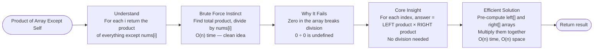
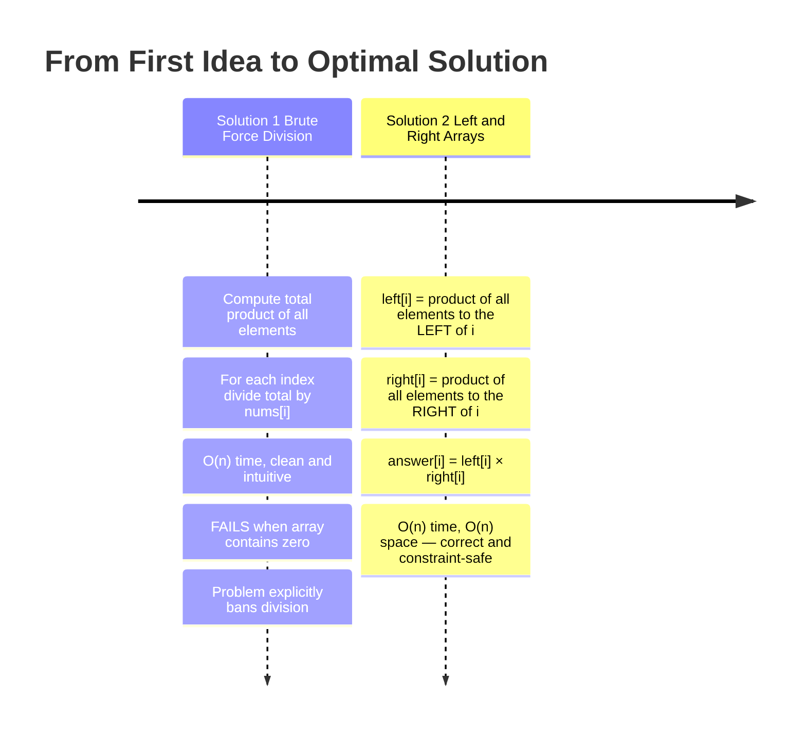
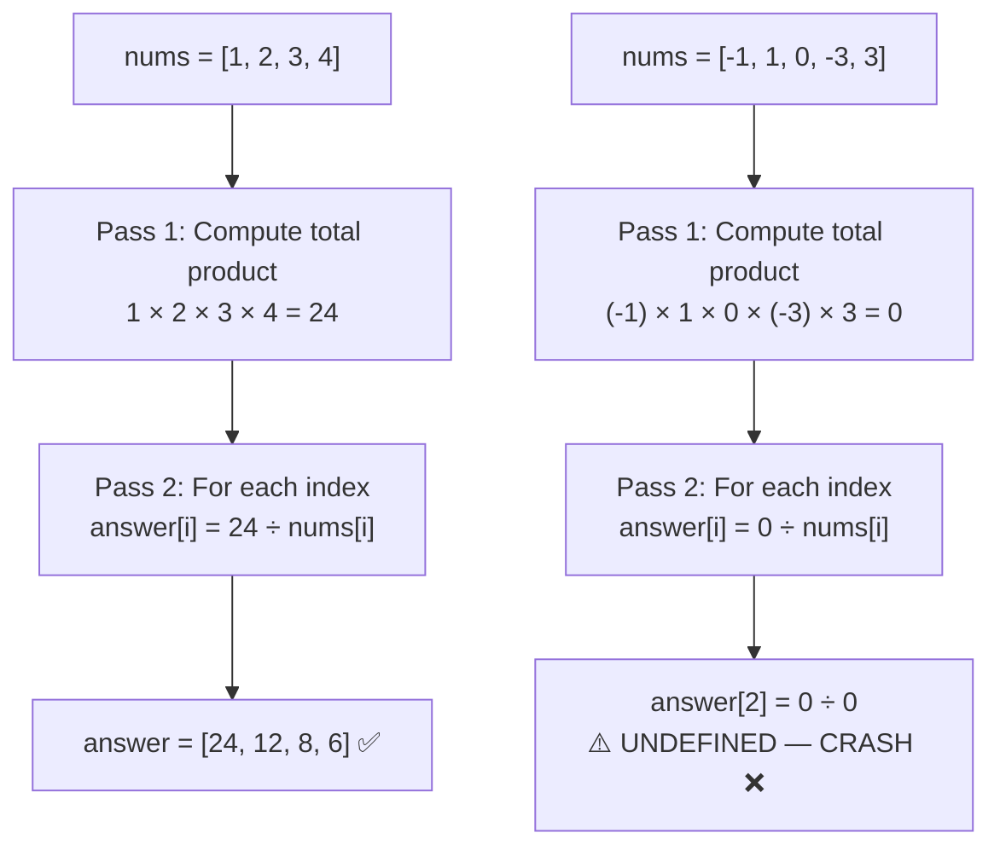
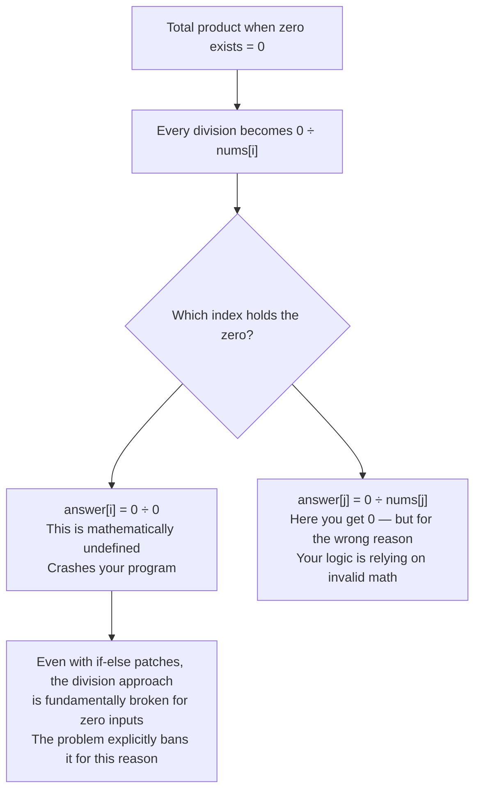
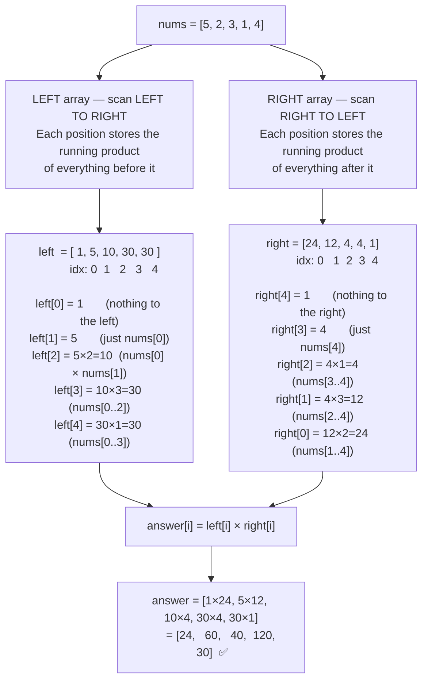
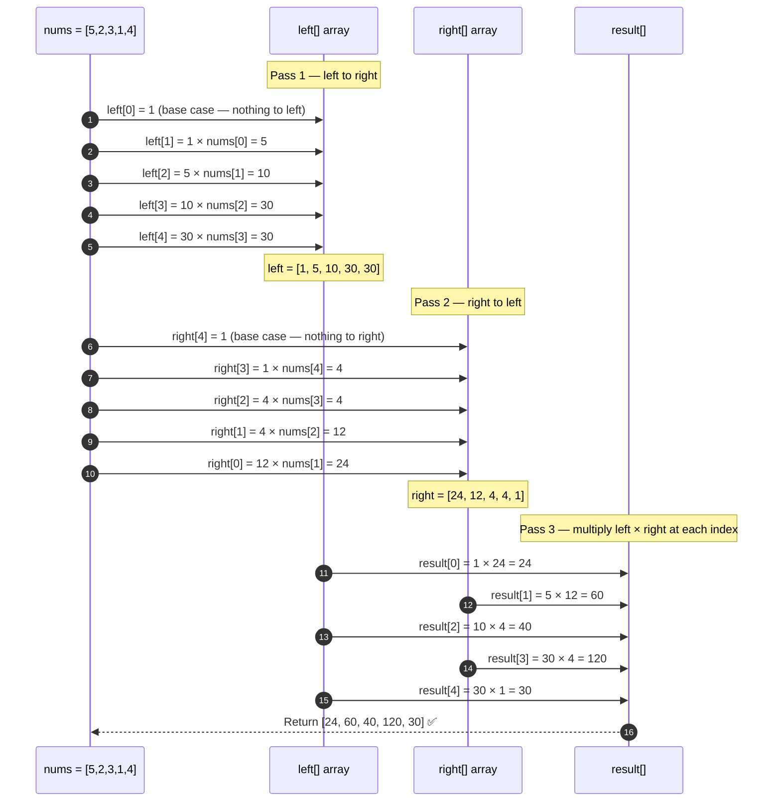

# 🔢 LeetCode #238 — Product of Array Except Self

> **[Open on LeetCode →](https://leetcode.com/problems/product-of-array-except-self/)**
> **Difficulty:** Medium | **Topic:** Array, Prefix Product

---

## 📋 Problem Statement

Given an integer array `nums`, return an array `answer` such that `answer[i]` is equal to the **product of all elements of `nums` except `nums[i]`**.

**You must write an algorithm that runs in O(n) time and without using the division operation.**

**Constraints:**
```
2 <= nums.length <= 10^5
-30 <= nums[i] <= 30
The product of any prefix or suffix of nums is guaranteed to fit in a 32-bit integer.
```

---

## 📌 Examples

```
Input:  nums = [1, 2, 3, 4]
Output: [24, 12, 8, 6]

Reason:
  answer[0] = 2 × 3 × 4 = 24   (everything except index 0)
  answer[1] = 1 × 3 × 4 = 12   (everything except index 1)
  answer[2] = 1 × 2 × 4 = 8    (everything except index 2)
  answer[3] = 1 × 2 × 3 = 6    (everything except index 3)


Input:  nums = [-1, 1, 0, -3, 3]
Output: [0, 0, 9, 0, 0]

Reason:
  answer[2] = (-1) × 1 × (-3) × 3 = 9   (the zero is excluded here)
  all other positions multiply with the 0 → result is 0
```

---

## 🗺️ Understanding the Problem First

Before touching any code, make sure you understand what the problem is actually asking.

```mermaid
mindmap
  root((Product of Array Except Self))
    What am I given?
      Integer array nums
    What do I return?
      A new array answer
      answer[i] = product of all nums EXCEPT nums[i]
    Constraints to respect
      Must run in O(n) time
      Cannot use division
    Edge cases to think about
      Array containing zero
      Division by zero would fail
      Zero in the array changes everything
    Core question
      For each position i
      How do I get the product of everything to its LEFT
      and the product of everything to its RIGHT
      without dividing?
```

---

## 🧭 The Two Phases of Solving



---

## 🔑 Core Insight Before Any Code

For any index `i`, the answer is simply:

```
answer[i] = (product of everything to the LEFT of i)
          × (product of everything to the RIGHT of i)
```

For example, with `nums = [5, 2, 3, 1, 4]`, to find the answer for index 2 (value `3`):

```
Left of index 2  → 5 × 2 = 10
Right of index 2 → 1 × 4 = 4

answer[2] = 10 × 4 = 40  ✅
```

This means if you pre-compute a `left` array and a `right` array in two passes, you can build the final answer in a third pass — entirely without division.

---

## 📊 Solution Progression Overview



---
---

# ✏️ Solution 1 — Brute Force (Division Approach)

## The Problem-Solver's Thinking

**My starting thought:** *"The most natural thing — if the product of the entire array is 24, and I want the product of everything except `nums[i]`, I can just divide: `24 / nums[i]`. One pass to get the total product. One pass to divide it out. Simple."*

```
nums = [1, 2, 3, 4]
Total product = 1 × 2 × 3 × 4 = 24

answer[0] = 24 / 1 = 24
answer[1] = 24 / 2 = 12
answer[2] = 24 / 3 = 8
answer[3] = 24 / 4 = 6  ✅
```

This is clean, O(n), and intuitive. Most people think of this first.

---

## Visual — What Brute Force Does



---

## Why This Approach Breaks



You can add special `if` conditions to handle the zero case, but at that point you are fighting the problem rather than solving it. The constraint *"no division"* exists precisely because this approach fails. The interview is testing whether you can find the clean path.

---

## Complexity

```
Time:  O(n)  — two passes through the array
Space: O(1)  — only a variable for total product

Verdict: REJECTED — banned by problem constraints, and fails on zero inputs
```

---

## ✅ Brute Force Code (for understanding — do not submit)

```python
from typing import List

class Solution:
    def productExceptSelf(self, nums: List[int]) -> List[int]:
        total_product = 1
        for num in nums:
            total_product *= num            # compute total product

        result = []
        for num in nums:
            result.append(total_product // num)   # divide out each element

        return result
        # ⚠️ This FAILS when nums contains 0 (0 ÷ 0 is undefined)
        # ⚠️ Also uses division, which the problem forbids
```

---

## The Question to Ask Yourself

> *"Why did division feel natural? Because for index `i`, I wanted the product of everything except `nums[i]`. Division was just a shortcut. But what if I could compute that directly — the product of everything to the LEFT separately, and the product of everything to the RIGHT separately, and then multiply them? No division ever needed."*

That question is the entire key to the efficient solution.

---
---

# ✏️ Solution 2 — Left and Right Prefix Products (Efficient)

## The Problem-Solver's Thinking

**New thought:** *"For each index `i`, the answer I need is: (product of all elements before `i`) × (product of all elements after `i`). These two parts — left product and right product — can each be computed in one pass. Then I combine them. No division, no zero issues, O(n) total."*

The trick is understanding what the "left" and "right" arrays actually store:

```
left[i]  = product of all elements STRICTLY to the LEFT of index i
right[i] = product of all elements STRICTLY to the RIGHT of index i

For the leftmost element,  left[0]        = 1  (nothing to its left)
For the rightmost element, right[n-1]     = 1  (nothing to its right)
```

---

## Visual — Building left[] and right[] for [5, 2, 3, 1, 4]



---

## Why Starting Values Are 1

This is the most important thing to internalize before writing code.

```
left[0] = 1  because: there is NOTHING to the left of index 0.
                      The product of zero elements is 1 (multiplicative identity).

right[n-1] = 1  because: there is NOTHING to the right of the last index.
                          Same reason.

If you do NOT start with 1, you corrupt every subsequent product.
Think of it as: "I have seen nothing yet, so my accumulated product is 1."
```

---

## Step-by-Step Dry Run — [5, 2, 3, 1, 4]

**Building `left[]` (left → right, starting index 1):**

```
left = [1, 1, 1, 1, 1]     ← initialize all to 1

i=1: left[1] = left[0] × nums[0] = 1 × 5 = 5     → left = [1, 5, 1, 1, 1]
i=2: left[2] = left[1] × nums[1] = 5 × 2 = 10    → left = [1, 5, 10, 1, 1]
i=3: left[3] = left[2] × nums[2] = 10 × 3 = 30   → left = [1, 5, 10, 30, 1]
i=4: left[4] = left[3] × nums[3] = 30 × 1 = 30   → left = [1, 5, 10, 30, 30]
```

**Building `right[]` (right → left, starting index n-2):**

```
right = [1, 1, 1, 1, 1]    ← initialize all to 1

i=3: right[3] = right[4] × nums[4] = 1 × 4 = 4   → right = [1, 1, 1, 4, 1]
i=2: right[2] = right[3] × nums[3] = 4 × 1 = 4   → right = [1, 1, 4, 4, 1]
i=1: right[1] = right[2] × nums[2] = 4 × 3 = 12  → right = [1, 12, 4, 4, 1]
i=0: right[0] = right[1] × nums[1] = 12 × 2 = 24 → right = [24, 12, 4, 4, 1]
```

**Building `result[]` (one final pass):**

```
result[0] = left[0] × right[0] = 1  × 24 = 24
result[1] = left[1] × right[1] = 5  × 12 = 60
result[2] = left[2] × right[2] = 10 × 4  = 40
result[3] = left[3] × right[3] = 30 × 4  = 120
result[4] = left[4] × right[4] = 30 × 1  = 30

result = [24, 60, 40, 120, 30]  ✅
```

---

## Walkthrough as a Sequence



---

## Why Zero Is No Longer a Problem

```
nums = [-1, 1, 0, -3, 3]

left  = [1, -1, -1, 0, 0]
right = [0,  0,  9, -9, 1]    (← the 9 appears at right[2] because 0 is excluded)

result[2] = left[2] × right[2] = -1 × -9 = 9  ✅

No division anywhere. Zero is just another number being multiplied.
The algorithm is completely indifferent to zeros.
```

---

## Complexity

```
Time:  O(n)  — three separate O(n) passes = 3n → simplified to O(n)
Space: O(n)  — O(n) for left array + O(n) for right array + O(n) for result
```

---

## ✅ Full LeetCode Solution

```python
from typing import List

class Solution:
    def productExceptSelf(self, nums: List[int]) -> List[int]:
        n = len(nums)

        # Array to store all left prefix products
        left = [1] * n
        for i in range(1, n):
            left[i] = left[i - 1] * nums[i - 1]

        # Array to store all right suffix products
        right = [1] * n
        for i in range(n - 2, -1, -1):
            right[i] = right[i + 1] * nums[i + 1]

        # Combine: result[i] = product of everything to the left × everything to the right
        result = [1] * n
        for i in range(n):
            result[i] = left[i] * right[i]

        return result
```

---

## Reading the Code Loop by Loop

**Loop 1 — building `left[]`:**

```python
for i in range(1, n):
    left[i] = left[i - 1] * nums[i - 1]
```

We start from index 1 because `left[0] = 1` always (nothing to the left of index 0). At each step: the product to the left of `i` is the product to the left of `i-1`, multiplied by `nums[i-1]` itself.

**Loop 2 — building `right[]`:**

```python
for i in range(n - 2, -1, -1):
    right[i] = right[i + 1] * nums[i + 1]
```

We start from index `n-2` because `right[n-1] = 1` always (nothing to the right of the last element). We go backwards. At each step: the product to the right of `i` is the product to the right of `i+1`, multiplied by `nums[i+1]` itself.

**Loop 3 — combining:**

```python
for i in range(n):
    result[i] = left[i] * right[i]
```

Straightforward multiplication. No conditions. No special casing.

---

## Full Comparison

```mermaid
quadrantChart
    title Product of Array Except Self — Approach Trade-Off Map
    x-axis Simpler Logic --> More Structured Logic
    y-axis Fails Constraints --> Satisfies All Constraints
    quadrant-1 Correct and well-structured
    quadrant-2 Correct and simple
    quadrant-3 Incorrect approach
    quadrant-4 Structured but fails
    Brute Force Division O(n) but breaks: [0.20, 0.15]
    Left and Right Arrays O(n) no division: [0.75, 0.92]
```

---

## 🔁 The Reusable Pattern

```python
# Left-Right Prefix Product Pattern
# Use when: you need the product (or sum, or any operation) of
#           everything to the LEFT and RIGHT of each index

left = [1] * n
for i in range(1, n):
    left[i] = left[i - 1] * nums[i - 1]    # build left prefix

right = [1] * n
for i in range(n - 2, -1, -1):
    right[i] = right[i + 1] * nums[i + 1]  # build right suffix

for i in range(n):
    result[i] = left[i] * right[i]          # combine at each index
```

Apply this pattern to: **subarray range queries, span problems, trapping rain water, visibility problems, or any problem where each answer depends on its neighbors in both directions.**

---

## ✅ Final Takeaways

```
1. First instinct (division) is natural but breaks on zero and is banned.
2. Every answer[i] = (product of everything LEFT of i) × (product of everything RIGHT of i).
3. Pre-compute both sides in two separate passes. Combine in a third.
4. left[0] = 1 and right[n-1] = 1 because the multiplicative identity of "nothing" is 1.
5. Three O(n) passes = O(n) total. Space is O(n) for the two helper arrays.
6. Zero in the array is handled naturally — no special casing needed.
```

> 💡 When a problem asks you to compute something "for every element using everything except itself", think about splitting the work into **what's to the left** and **what's to the right**, then combining. Division is never needed.
